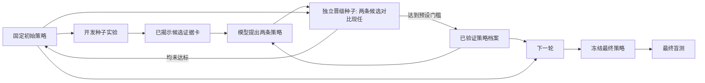

# 按主流 RSI 路径做的一次实测

参考 [GEPA](https://arxiv.org/abs/2507.19457) 的“看完整轨迹、提出多个候选、测量后选择”和 [ACE](https://arxiv.org/abs/2510.04618) 的“把被验证的经验增量保存在结构化档案”思路，我们给 CARE 2.0 做了一个小规模适配版。它不是两篇论文算法的完整复现，也没有在搜索过程中更新模型权重。

上一版只让模型看两个策略的平均分，随后无条件部署它选的新版本。这一版改成：从真实揭示过的候选中提取特征、测量值和命中规则；模型每轮提出两条可执行策略；两条都与现任策略在独立种子上配对比较；只把过门的策略连同测量证据放入短档案，供下一轮使用；最后再打开盲测集。

| 目标任务 | 档案分支盲测 AUC | 固定初始 | 旧式稀疏 RSI | 档案 vs 旧式，配对差值 | 档案实际动作 |
|---|---:|---:|---:|---:|---|
| ESOL，初始不看来源任务 | **93.11** | 93.11 | 92.68 | +0.43；95%区间 +0.05～+0.90 | 四条候选全部被拒绝，避免退步 |
| Phonons，新种子复测 | **57.90** | 49.03 | 49.03 | +8.87；95%区间 −4.44～+22.27 | 第一轮晋级一条策略，第二轮拒绝两条 |

ESOL 的初始分数已经很高，新机制没有强行修改它。Phonons 的第一轮策略把“偏好硫族化合物”换成了“偏好氧化物”，在 8 个晋级种子上平均 AUC 提高 26.19，6 胜 1 平 1 负；最终盲测保持了正向点估计。但这只是**搜索策略在公开数据池中的经验效果**，不是氧化物更好的物理机理证明。

目前能说的是：在这两次固定模型调用的诊断里，独立晋级门避免了无效修订，并在 phonons 上留下了一条有潜力的策略。不能说“双候选搜索”本身已被证明有效，因为 phonons 的赢家本来也是模型首选；也不能声称跨任务稳定提升，因为 phonons 的盲测区间跨 0，而且 ESOL 的收益完全来自保留初始策略。档案分支比旧式分支花了更多晋级实验预算，也需要做等预算对照。

还有一个代码层面的限制：沿用的通用生成提示词把语义规则描述为会进入 ridge 代理模型，但本次调用的 `run_direct_prior_skill` 执行器实际使用固定规则分数与 GP 排名融合；`ridge` 和 `prior_scale` 在这条执行路径上不起作用。原始提示词与实际执行轨迹均已保存，因此本次数字仍可审计，但后续应修正这段执行器说明并做独立对照，避免模型优化无效参数。

下一阶段应优先扩大**模型调用次数和任务数**，并把策略选择预算配平：比较“只测模型首选”和“同预算测两条候选”，在未参与设计的目标任务上确认是否有额外收益。等积累足够多经过独立实验验证的接受／拒绝轨迹，再考虑借鉴 [SCoRe](https://arxiv.org/abs/2409.12917) 和 [Agent Lightning](https://arxiv.org/abs/2508.03680) 做偏好学习或在线强化学习。现在只有一条被晋级的档案策略，直接后训练容易把偶然结果学成规则。

完整原始请求、响应、逐种子轨迹、晋级比较、盲测结果和哈希位于 [ESOL 实验](../experiments/care_replay/results/2026-09-17-rsi-archive-search-esol-target-only-v1/README.md) 与 [phonons 实验](../experiments/care_replay/results/2026-09-17-rsi-archive-search-phonons-v1/README.md)。
