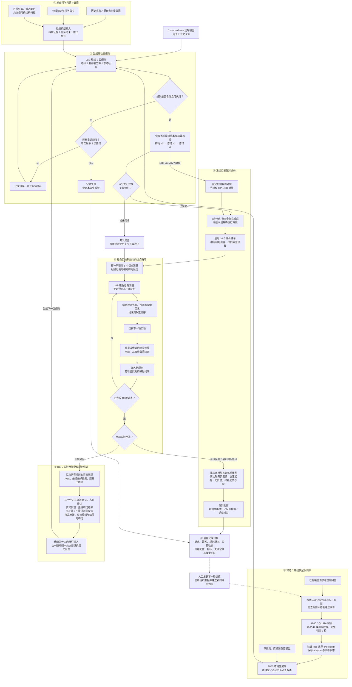

# CARE 2.0：RSI 全流程图

从数据准备到模型训练、实验选点、反馈修订、配对评价与归档的完整流程。实验节点目前使用离线测量数据重放。图中数字对应本次配置；虚线表示人工发起的后续训练，不是本轮自动回训。

## 三种更新分别发生在哪里

- **神经网络参数**：在离线 QLoRA 训练阶段更新；在线搜索和规则修订期间保持冻结。
- **GP 预测与不确定性**：每获得一个实验测量结果后更新；仅 GP-UCB 对照不使用 LLM 规则先验。
- **规则与部署选择**：LLM 读取开发反馈后修订，形成 v0 → v1 → v2；无反馈组不接收测量反馈。

评价种子的反馈不进入本轮规则修订或 checkpoint 选择。下一轮训练需要另行整理数据、建立新的训练／评价划分并人工发起。当前训练和评价仍复用任务及有限候选池，流程完成不能单独证明跨任务泛化或递归增益。

## 对应实现与实验记录

- [数据构建](../experiments/care_replay/scripts/export_rsi_full_dataset.py)
- [A800 QLoRA 训练](../experiments/care_replay/scripts/train_rsi_qlora.py)
- [生成、反馈修订、冻结与评价](../experiments/care_replay/scripts/run_rsi_live_feedback.py)
- [实验内 GP 与规则先验选点](../experiments/care_replay/scripts/llm_semantic_skills.py)
- [训练完成报告与权重校验](../experiments/care_replay/results/2026-09-15-rsi-qwen25-32b-full-sft-v4/README.md)
- [训练前后 RSI 配对对照结果](../experiments/care_replay/results/2026-09-15-rsi-posttraining-comparison-v1/README.md)
