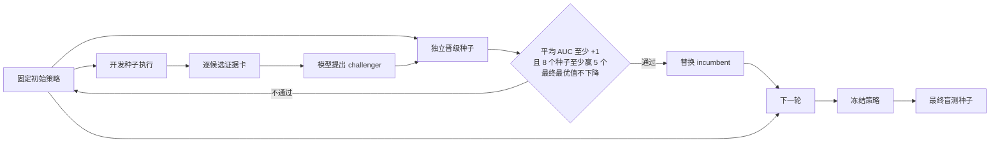

# 主流 RSI 路径与 CARE 2.0 的下一步

这里的 RSI 指“系统利用运行反馈，改进下一轮行为或策略”。需要区分两件事：运行时自我修订可以在不改模型权重的情况下发生；持续、开放式地改进模型自身能力则需要更强的验证器、训练闭环和跨任务证据。CARE 2.0 目前属于前者。

## 目前常见的路径

| 路径 | 代表工作 | 更新什么 | 优点 | 主要风险 | CARE 2.0 采用方式 |
|---|---|---|---|---|---|
| 语言反思与情景记忆 | [Reflexion](https://arxiv.org/abs/2303.11366) | 上下文、记忆 | 不训练权重，样本少时也能迭代 | 反思可能只是合理化，错误会写回记忆 | 保留实验记忆，但只写入实际揭示的数据 |
| 文本梯度 | [TextGrad](https://arxiv.org/abs/2406.07496) | 提示词、规则、复合系统组件 | 比单个标量奖励包含更多失败原因 | 反馈质量决定方向，可能过拟合少量轨迹 | 把逐候选测量、命中规则、提升量编成证据卡 |
| 提示词/策略进化 | [GEPA](https://arxiv.org/abs/2507.19457) | 多个策略候选及其组合 | 从完整轨迹诊断问题，并测试更新；比只看稀疏奖励更省样本 | 搜索成本与选择偏差；必须有独立评估 | 采用 incumbent/challenger，并在独立种子上晋级 |
| 结构化上下文演化 | [ACE](https://arxiv.org/abs/2510.04618) | 可累积的 playbook | 逐条增加和整理经验，减轻整段重写造成的遗忘 | 上下文会膨胀，错误经验会长期残留 | 后续把通过晋级门的经验沉淀为短规则卡 |
| 自纠正强化学习 | [SCoRe](https://arxiv.org/abs/2409.12917) | 模型权重 | 在模型自身分布上训练多轮纠错 | 数据量、奖励和训练稳定性要求高；离线纠错 SFT 可能分布错位 | 等积累跨任务、已验证的接受/拒绝轨迹后再做 |
| 通用 Agent RL | [Agent Lightning](https://arxiv.org/abs/2508.03680) | Agent 策略权重 | 把执行与训练解耦，并对长轨迹做信用分配 | 工程和样本成本高，验证器弱时会学偏 | 作为后训练阶段的候选框架，不放进当前小样本闭环 |
| 开放式递归改进 | [RSI survey](https://arxiv.org/abs/2607.07663) | 行为、策略、评估器、研究流程 | 覆盖从局部自修订到研究闭环 | 能力上限取决于外部验证；仅凭自评很难证明开放式改进 | 用真实实验/回放指标作为外部验证器，并限定结论边界 |

## 为什么当前反馈会“越改越差”

旧流程只给模型两个策略的平均 AUC、最终最优值和每个种子的汇总分。模型知道“分数不好”，却不知道具体选了哪些材料、哪些公开特征对应高值或低值、哪条规则在哪一轮命中。它只能根据很稀疏的标量重新写规则。

旧流程还会无条件部署模型选出的最后一个版本。phonons 结果已经显示：初始训练后策略较强，但两轮真实反馈修订后，平均 AUC 下降。这说明“会修改”不等于“修改有效”。

## 本次落地的 vNext

具体改动如下：

1. **候选级证据**：对每个实际选中的候选，提供公开特征、揭示值、相对上一最佳值的提升和命中规则；同时给出规则与特征的描述性汇总。未测候选的标签不会进入提示词。
2. **三段种子隔离**：开发种子用于生成反馈；晋级种子只决定是否替换旧策略；最终盲测种子只用于报告。
3. **保守晋级**：challenger 必须在 8 个配对晋级种子上达到预先写死的三个条件：平均 AUC 至少提高 1.0、至少 5 胜、平均最终最优值不下降。任一条件失败就继续使用 incumbent。
4. **对照分支**：`sparse_ungated` 保留旧式“汇总分数＋无条件部署”，`rich_gated` 使用新证据和晋级门；两者共享初始策略、开发种子和最终盲测种子。
5. **暂不更新权重**：本轮先验证反馈和选择机制。只有跨任务、多轮稳定通过晋级门的轨迹，才适合转成 SFT、偏好学习或在线 RL 数据。

这次优化的主要目标是先消除“修订后明显退步”。如果 rich challenger 没有可靠提升，正确行为是保留已经较强的初始策略，而不是为了体现 RSI 而强制修改。
