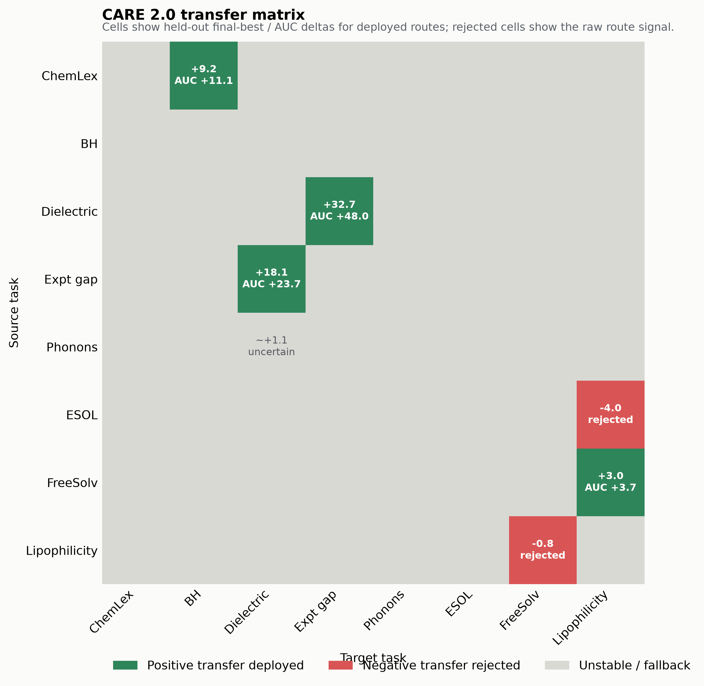
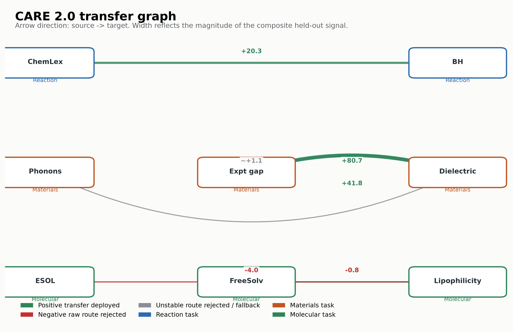
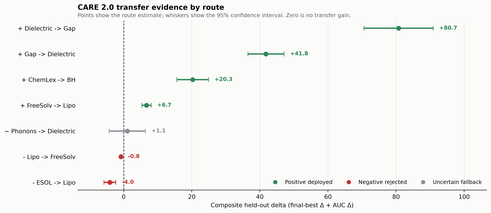
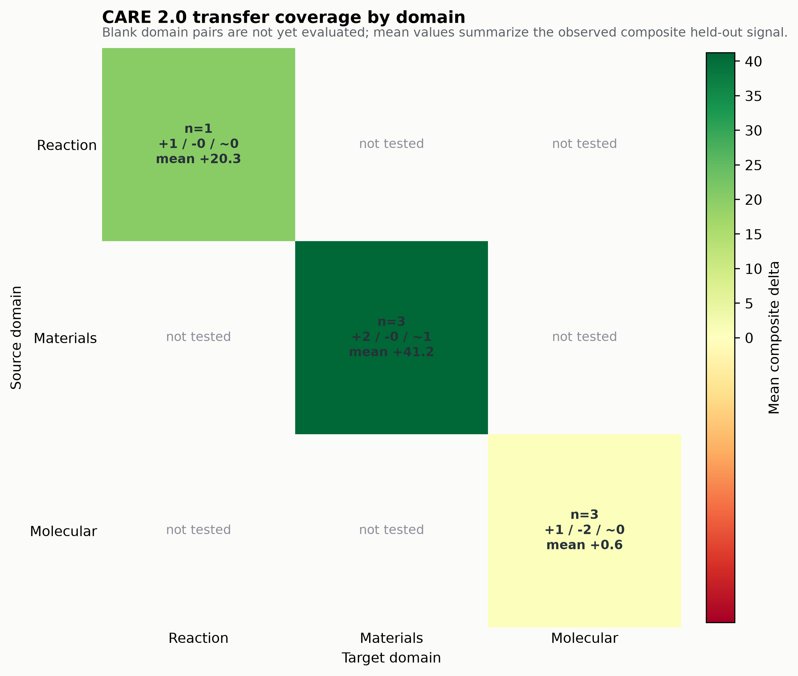

# CARE Replay Experiment

This is a lightweight CARE 2.0 replay harness for the first experiment pass.

Current status:

- Uses synthetic finite candidate pools for Suzuki-style reaction optimization,
  ChemLex-style acid-amine optimization, and materials formulation optimization.
- Includes public real HTE adapters for Dreher-Doyle Buchwald-Hartwig and
  Perera Suzuki-Miyaura data from `rxn4chemistry/rxn_yields`.
- Includes the updated public ChemLex Acid-Amine wetlab adapter from Zenodo.
- Includes a MoleculeNet ESOL adapter for molecular property finite-pool replay.
- Includes MoleculeNet FreeSolv and Lipophilicity adapters for additional
  molecular-property generalization checks.
- Includes a Matbench experimental band-gap adapter for real materials
  composition-property replay.
- Includes Matbench phonons and log bulk-modulus adapters for additional real
  materials-property generalization checks.
- Uses an RDKit reaction representation for the updated ChemLex Acid-Amine
  wetlab record: 24 normalized acid/amine descriptors plus public functional
  and ring-system classes.
- Supports optional LLM-in-the-loop modes through an OpenAI-compatible endpoint.
- Implements the CARE 2.0 minimum loop:
  `TaskSpec -> SkillCard -> HypothesisEntry -> GateCertificate -> AuditLog -> Metrics`.
- Does not claim to reproduce CARE 1.0 paper numbers. It is a smoke test for the experiment interface while the original CARE 1.0 repo / public candidate tables are being confirmed.
- Tracks upcoming dataset intake requirements in `datasets/intake.md`,
  including Kimi-Lex and Materials Project blockers.
- Supports a calibration-only strategy router over target-only BO,
  target-calibrated semantic skills, LLM-direct priors, and LLAMBO-style
  warm-starting. The selected route is frozen before held-out replay.
- Evaluates candidate source-outcome mechanisms: fixed measured source histories
  provide neighbor, additive, interaction, initial-design, and kernel priors;
  revealed target observations calibrate them online, with an exact matched
  target-only LLM fallback when offline replay selection rejects transfer.
- Freezes the canonical method in [`CARE2_METHOD.md`](CARE2_METHOD.md). Every
  confirmed pair now emits one executable `TransferSkill` and one compact
  source-to-deployment trace in addition to the full audit logs.
- Adds a real multi-source wet-lab benchmark using Reizman Suzuki cases 1-3 as
  completed sources and case 4 as a task-disjoint confirmation target. See
  [`MULTISOURCE_WETLAB_PROTOCOL.md`](MULTISOURCE_WETLAB_PROTOCOL.md).
- Adds a persistent agent-readable `SkillBank` under
  `skill_banks/care2-wetlab-transfer/` plus a leakage-resistant sequential
  `ask()` / `tell()` boundary.
- Adds 13 real Baumgartner C-N campaigns and a task-disjoint benchmark for
  source-guided diverse initial design. The first nine campaigns select and
  freeze the route; the final four are confirmation tasks. See
  [`BAUMGARTNER_WARMSTART_PROTOCOL.md`](BAUMGARTNER_WARMSTART_PROTOCOL.md).
- Adds a v2 source-quality floor and a separate Baumgartner Suzuki external
  confirmation target. See
  [`BAUMGARTNER_WARMSTART_V2_PROTOCOL.md`](BAUMGARTNER_WARMSTART_V2_PROTOCOL.md).
- Adds an Opus 4.8 proposer/critic controller with full round participation,
  bounded authority over the target-GP top five, expected-improvement evidence,
  outcome-blind initial hypotheses, and complete model-call traces. The combined
  evidence report is in
  [`results/2026-08-16-opus48-generalization-evidence-v1/REPORT.md`](results/2026-08-16-opus48-generalization-evidence-v1/REPORT.md).
- Freezes a repeated-trajectory confirmation protocol across all 11 audited
  routes. It requires 30 independent online trajectories per route and suppresses
  confirmatory inference until the full 330-trajectory panel is complete. See
  [`configs/online_llm_repeated_confirmation_v1.json`](configs/online_llm_repeated_confirmation_v1.json).
- Adds a second frozen execution protocol with identical scientific settings
  and explicit retry semantics for rate limits, cost caps, timeouts, and other
  infrastructure failures. Failed attempts remain in the audit tree; malformed
  model outputs are terminal and scientific outcomes are never retried. See
  [`configs/online_llm_repeated_confirmation_v2.json`](configs/online_llm_repeated_confirmation_v2.json).

Run:

```bash
python3 experiments/care_replay/scripts/run_synthetic_suzuki.py --dataset synthetic_suzuki_i --seeds 30 --rounds 10
python3 experiments/care_replay/scripts/run_synthetic_suzuki.py --dataset synthetic_chemlex_i --seeds 30 --rounds 10
python3 experiments/care_replay/scripts/run_synthetic_suzuki.py --dataset synthetic_materials_i --seeds 30 --rounds 10
python3 experiments/care_replay/scripts/run_synthetic_suzuki.py --dataset real_buchwald_hartwig --seeds 30 --rounds 10
python3 experiments/care_replay/scripts/run_synthetic_suzuki.py --dataset real_suzuki_miyaura --seeds 30 --rounds 10
python3 experiments/care_replay/scripts/run_synthetic_suzuki.py --dataset real_chemlex_acidamine --seeds 30 --rounds 10
python3 experiments/care_replay/scripts/run_synthetic_suzuki.py --dataset real_moleculenet_esol --seeds 30 --rounds 10
python3 experiments/care_replay/scripts/run_synthetic_suzuki.py --dataset real_moleculenet_freesolv --seeds 30 --rounds 10
python3 experiments/care_replay/scripts/run_synthetic_suzuki.py --dataset real_moleculenet_lipophilicity --seeds 30 --rounds 10
python3 experiments/care_replay/scripts/run_synthetic_suzuki.py --dataset real_matbench_expt_gap --seeds 30 --rounds 10
python3 experiments/care_replay/scripts/run_synthetic_suzuki.py --dataset all --seeds 30 --rounds 10
```

Calibrate and then confirm the Baumgartner initial-design skill:

```bash
python3 experiments/care_replay/scripts/run_multisource_warmstart.py calibrate \
  --config experiments/care_replay/configs/baumgartner_multisource_warmstart_v1.json \
  --output-dir /tmp/care2-baumgartner-development

python3 experiments/care_replay/scripts/run_multisource_warmstart.py confirm \
  --config experiments/care_replay/configs/baumgartner_multisource_warmstart_v1.json \
  --selection-record /tmp/care2-baumgartner-development/selection_record.json \
  --output-dir /tmp/care2-baumgartner-confirmation
```

Every method receives three initial observations and ten target reveals. The
transfer route uses source outcomes only for initial design; all methods then
run the same target-only GP-UCB. Random initialization and deterministic mixed
space filling are both treated as baselines.

Run a real LLM-in-the-loop smoke test:

```bash
export CARE_LLM_API_KEY="..."
python3 experiments/care_replay/scripts/run_synthetic_suzuki.py --dataset synthetic_materials_i --seeds 3 --rounds 6 --initial 5 --modes no_care_random,incumbent,llm_no_gate,llm_gate_v1 --llm-model openai/gpt-4o-mini --output-tag llm_commonstack
```

Run the evidence-bounded LLM scientist loop:

```bash
export COMMONSTACK_API_KEY="..."

python3 experiments/care_replay/scripts/run_llm_initial_design_hypothesis.py generate \
  --config experiments/care_replay/configs/baumgartner_multisource_warmstart_v2.json \
  --target-task real_baumgartner_suzuki_minlp2 \
  --source-tasks real_baumgartner_suzuki_minlp1 \
  --output /tmp/care2/hypothesis.json

python3 experiments/care_replay/scripts/run_llm_initial_design_hypothesis.py reflect \
  --config experiments/care_replay/configs/baumgartner_multisource_warmstart_v2.json \
  --hypothesis-record /tmp/care2/hypothesis.json \
  --initial-design-mode compiled \
  --output /tmp/care2/reflection.json

python3 experiments/care_replay/scripts/run_llm_initial_design_hypothesis.py evaluate \
  --config experiments/care_replay/configs/baumgartner_multisource_warmstart_v2.json \
  --hypothesis-record /tmp/care2/hypothesis.json \
  --reflection-record /tmp/care2/reflection.json \
  --output-dir /tmp/care2/evaluation
```

Run or resume the frozen repeated-trajectory confirmation:

```bash
export COMMONSTACK_API_KEY="..."

python3 experiments/care_replay/scripts/run_repeated_online_llm_confirmation.py \
  --suite-config experiments/care_replay/configs/online_llm_repeated_confirmation_v1.json \
  --output-root experiments/care_replay/results/2026-08-23-online-llm-repeated-confirmation-v1 \
  --continue-on-error
```

`--max-new-runs N` may be used to execute the frozen queue incrementally. It
does not change the declared sample size. Until every route has all 30
trajectories, the generated report is marked incomplete and its confirmatory
decision is disabled.

For an independent run with auditable infrastructure retries:

```bash
export COMMONSTACK_API_KEY="..."

python3 experiments/care_replay/scripts/run_repeated_online_llm_confirmation_v2.py \
  --suite-config experiments/care_replay/configs/online_llm_repeated_confirmation_v2.json \
  --output-root experiments/care_replay/results/2026-08-23-online-llm-repeated-confirmation-v2 \
  --continue-on-error
```

The v2 runner permits up to three attempts only for predeclared infrastructure
failures. It preserves every attempt, uses a per-trajectory process lock, and
still disables confirmatory inference unless all 330 trajectories complete.

The initial LLM sees completed source outcomes and public target conditions but
no target outcomes. After the initial design is executed, the reflection LLM
sees only those revealed target observations, revises or falsifies the
hypothesis, and proposes follow-up experiments or stops transfer. A frozen
acquisition-risk gate decides whether a proposal may spend the remaining target
budget; rejected proposals remain in the trace and knowledge base. The
five-target retrospective archive is in
[`results/2026-08-14-llm-reflective-scientist`](results/2026-08-14-llm-reflective-scientist/README.md).

Run the high-participation online LLM scientist. The initial LLM selects three
outcome-blind experiments; after they are revealed, the LLM selects every next
experiment from a compact menu containing target-only GP-UCB, source-prior, and
rank-fusion consensus plus geometric probes. The trace records each prompt, validated decision, executed
candidate, and subsequent reveal. The main causal comparison is against the
same LLM initial design followed by target-only GP-UCB, under the same budget.

```bash
export COMMONSTACK_API_KEY="..."

python3 experiments/care_replay/scripts/run_online_llm_scientist.py generate-initial \
  --config experiments/care_replay/configs/baumgartner_multisource_warmstart_v1.json \
  --target-task real_baumgartner_cn_phenethylamine_alphos \
  --source-tasks real_baumgartner_cn_aniline_alphos \
  --llm-model anthropic/claude-fable-5 \
  --per-view-limit 6 \
  --output /tmp/care2-online/initial.json

python3 experiments/care_replay/scripts/run_online_llm_scientist.py run \
  --config experiments/care_replay/configs/baumgartner_multisource_warmstart_v1.json \
  --initial-record /tmp/care2-online/initial.json \
  --initial-design-mode auto \
  --llm-model anthropic/claude-fable-5 \
  --fail-on-llm-error \
  --output-dir /tmp/care2-online/evaluation
```

For a native Anthropic-compatible endpoint, use `--llm-api-mode anthropic`, set
`--llm-base-url` to the endpoint root, and point `--llm-api-key-env` to the
environment variable holding the token. No API key is written to a trace or
result artifact.

Run the Opus high-authority suites:

```bash
export COMMONSTACK_API_KEY="..."

python3 experiments/care_replay/scripts/run_online_llm_suite.py \
  --suite-config experiments/care_replay/configs/opus48_high_authority_development_v1.json \
  --output-root experiments/care_replay/results/2026-08-16-opus48-bounded-ei-development-v2 \
  --skip-existing

python3 experiments/care_replay/scripts/run_online_llm_suite.py \
  --suite-config experiments/care_replay/configs/opus48_high_authority_chemistry_holdout_v1.json \
  --output-root experiments/care_replay/results/2026-08-16-opus48-high-authority-chemistry-holdout-v1 \
  --skip-existing
```

The primary comparison keeps the LLM-selected initial observations fixed and
then compares online Opus decisions with target-only GP-UCB under the same
target budget. The current 11-route same-start audit records six wins, two ties,
and three losses, with mean best-so-far AUC delta `+1.7532` and route-bootstrap
95% interval `[+0.4147, +3.3149]`; the route sign test is not significant. The
complete 17-route retrospective inventory, which also includes earlier null and
negative development routes, records eight wins, four ties, and five losses,
with mean `+0.7618` and interval `[-0.5008, +2.0907]`.

The rule-fixed classical audit uses RGPE for a single source and multisource
RGPE for multiple sources. In the 11-route panel, online Opus averages `+3.2290`
against this fixed comparator, but the interval crosses zero. Against the
strongest realized route-wise baseline selected post hoc, it averages `-0.5496`
and records three wins, one tie, and seven losses. LLM participation and
decision authority remain 100%; the evidence does not establish that the
controller is the strongest optimizer on most routes.

The retrospective calibration-gate audit checks asserted LLM prediction error
after three online reveals. The threshold for each held-out route is chosen on
the other ten routes only; a triggered gate continues target-only GP from all
observations accumulated so far. This raises the mean delta versus target GP
from `+1.7532` to `+2.0357` and reduces the loss count from three to two. The
increment versus the ungated LLM is not statistically confirmed, so the gate is
treated as a negative-transfer control pending prospective repeated runs.

Run the frozen seven-pair source-outcome suite through the canonical entry point:

```bash
python3 experiments/care_replay/scripts/run_care2.py suite \
  --config experiments/care_replay/configs/source_outcome_benchmark.json \
  --strategy full_source_outcome \
  --calibration-seed-start 40000 \
  --heldout-seed-start 41000 \
  --pair-workers 12 \
  --parallel-pairs 7 \
  --output-tag frozen_source_outcome_v1
```

The suite fixes each source history before target replay and uses 50
calibration seeds plus 100 disjoint held-out seeds. It selects the source route
only when it clears paired stability and confidence checks against both the
matched target-only LLM and the strongest target-only BO route. Otherwise it
copies the matched target-only policy exactly. The archived confirmation is in
[`results/2026-07-24-source-outcome-transfer`](results/2026-07-24-source-outcome-transfer/README.md).
This selection is an offline replay protocol, not a deployable wet-lab gate:
calibration consumes archived target outcomes that would be expensive in a new
physical experiment.
The exact skill, thresholds, record hashes, and round-level deployment chain are
written as `*_transfer_skill.json` and `*_canonical_trace.jsonl` under
`outputs/runs/`.
Canonical runs now include `source_warmstart_only` and
`fixed_data_only_transfer` by default. These controls attribute gain separately
to source-informed initialization, post-initialization transfer, and the LLM
patch. Use `--no-mechanism-controls` only for debugging.

The schema-only router in `scripts/cross_task_router.py` proposes a candidate
transfer family from public task metadata: reaction component roles for HTE
tasks, or shared descriptor vocabulary for molecular/materials tasks. It never
reads target outcomes. The calibration gate still decides whether transfer is
deployed, so the proposal is an auditable alignment signal rather than a claim
of positive transfer.

Run the continuous FreeSolv extension with the same route and baseline logic:

```bash
python3 experiments/care_replay/scripts/run_source_outcome_suite.py \
  --config experiments/care_replay/configs/source_outcome_freesolv_continuous.json \
  --strategy full_source_outcome \
  --calibration-seed-start 50000 \
  --heldout-seed-start 51000 \
  --pair-workers 6 \
  --parallel-pairs 2 \
  --output-tag freesolv_continuous_v1
```

The current archive is in
`results/2026-07-24-freesolv-continuous/`; it keeps this 30/50 extension
separate from the headline 50/100 seven-pair claim.

For a frozen transfer portfolio, use
`run_calibrated_source_outcome_portfolio.py`. The candidate list is fixed before
replay; calibration chooses among it and held-out seeds only execute the chosen
candidate or the exact target-only fallback:

```bash
python3 experiments/care_replay/scripts/run_calibrated_source_outcome_portfolio.py \
  --llm-record experiments/care_replay/configs/source_outcome_llm/generalized_to_bh.json \
  --target-llm-record experiments/care_replay/results/2026-07-24-source-outcome-transfer/model_calls/chemlex_acidamine_to_buchwald_hartwig_matched_target_only_reaction_chemlex_to_buchwald_hartwig_target_only.json \
  --target-llm-mode gp_ucb \
  --source-dataset real_chemlex_acidamine \
  --target-dataset real_buchwald_hartwig \
  --calibration-seeds 30 --heldout-seeds 50 \
  --portfolio standard:0.45:matched,conservative:0.25:matched,positive:0.45:source_positive \
  --workers 8
```

The formal ChemLex → Buchwald-Hartwig portfolio archive is in
`results/2026-07-24-transfer-portfolio-bh/`. It selected `source_positive` and
beat the matched target-only route on 50 held-out seeds. The materials extension
in `results/2026-07-24-transfer-portfolio-materials/` rejected all candidates
and fell back exactly, which is retained as a negative control. The matching
MoleculeNet FreeSolv → Lipophilicity extension in
`results/2026-07-24-transfer-portfolio-freesolv-lipophilicity/` also rejected all
three candidates and fell back exactly on 20 held-out seeds. This is separate
from the earlier 50/100-seed molecular value-prior result: it uses a different
frozen protocol and is retained as a portfolio-generalization boundary case.
The three portfolio extensions are summarized in
`results/2026-07-24-transfer-portfolio-report/portfolio_report.md` and
`portfolio_report.json`.

The ChemLex → Buchwald-Hartwig gain has a matched warm-start-only control in
`results/2026-07-24-transfer-bh-warmstart-control/`. Because that control
matches the portfolio route seed by seed, the current claim for this extension
is source-informed initial-design transfer, not an independently established
continuous source-outcome gain.

The reverse materials initialization audit is kept separately in
`results/2026-07-24-transfer-materials-reverse-initialization/`. Its
source-extremes route is exactly reproduced by a transfer-mass-zero warm-start
control, so it is not counted as continuous source-outcome transfer.

The evidence ladder combining the source-schema semantic extension with the
stricter source-outcome portfolio is in
`results/2026-07-24-transfer-evidence-report/`. It reports 4/5 source-schema
paths with a significant primary gain over the matched target-only LLM and 5/5
over the strongest target-only BO. It separately labels continuous semantic
routes, warm-start-only routes, and exact source-outcome fallbacks; the latest
portfolio has one warm-start deployment and no independently confirmed
continuous source-outcome candidate.

The matched random-rule controls include a warm-start variant. The ESOL
warm-start null beats GP-UCB on its held-out batch, so initialization and
acquisition geometry are treated as separate explanations; a semantic CARE
claim must also beat the matched warm-start and strongest target-only routes.

The exploration-aware variants are `llm_explore_no_gate` and
`llm_explore_gate_v1`. They expose public factor coverage, request explicit
explore/exploit/avoid intents and a counter-hypothesis, calibrate confidence,
and report whether the LLM actually changes Top-1. See
`results/2026-07-19-exploration-aware-policy/` for the implementation preflight
and its limitations.

Run the strict batch-diversity ablation:

```bash
python3 experiments/care_replay/scripts/run_exploration_batch.py --dataset real_buchwald_hartwig --seeds 30 --seed-start 50 --rounds 6 --initial 8 --batch-size 2 --novelty-weight 0.04 --min-batch-distance 0.34 --max-acquisition-loss 0.02 --modes incumbent_batch,target_diverse_batch,target_diverse_batch_gate --output-tag batch30
```

Here `--rounds` is the total reveal budget, not the number of batches. Every
candidate in a batch is selected from the same pre-batch observations, and all
hidden target values are revealed only after the batch is complete. The gated
variant permits a diverse candidate only when its public acquisition loss is
within the configured bound. Add `llm_explore_batch_gate` to `--modes` only
when a live API key is available.

Run the nine-dataset LLM generalization sweep:

```bash
export CARE_LLM_API_KEY="..."
python3 experiments/care_replay/scripts/run_synthetic_suzuki.py --dataset all --seeds 5 --rounds 6 --initial 5 --modes no_care_random,incumbent,llm_no_gate,llm_gate_v1 --llm-model openai/gpt-4o-mini --output-tag llm_commonstack_5seed
```

The default LLM base URL is `https://api.commonstack.ai/v1`. The API key is read
from `CARE_LLM_API_KEY` or `COMMONSTACK_API_KEY`; it is never stored in the
repository.

For lower-cost models, use native JSON mode instead of forcing a function call:

```bash
export CARE_LLM_API_KEY="..."
export CARE_LLM_TRACE_LOG="experiments/care_replay/outputs/logs/cheap_skill_generation.jsonl"
python3 experiments/care_replay/scripts/run_llm_kernel_skill_evolution.py \
  --source-dataset real_suzuki_miyaura \
  --target-dataset real_buchwald_hartwig \
  --llm-model openai/gpt-4o-mini \
  --llm-structured-mode json \
  --patch-count 6 --seeds 10 --calibration-seeds 5
```

`--llm-api-mode completion` is also available for providers that expose only
`/completions`. API traces contain model, timing, usage, and success/failure
events, but never the API key.

Refine a generated portfolio from calibration-only diagnostics, then freeze the
selector before evaluating independent seeds:

```bash
python3 experiments/care_replay/scripts/generate_refined_llm_kernel_skills.py \
  --llm-record first_round_llm_record.json \
  --calibration-summary first_round_summary.json \
  --target-dataset real_buchwald_hartwig \
  --output refined_llm_record.json

python3 experiments/care_replay/scripts/run_calibrated_frozen_llm_selector.py \
  --llm-record refined_llm_record.json \
  --source-dataset real_suzuki_miyaura \
  --target-dataset real_buchwald_hartwig \
  --calibration-seeds 100 --heldout-seeds 100
```

The refinement prompt receives patch-level calibration means, uncertainty, and
fold stability only. Held-out outcomes are excluded by construction. If no LLM
patch clears the frozen rule, the selector exactly falls back to the strongest
calibrated target-only baseline.

To execute both the LLM-shaped kernel and its source prior, use the calibrated
prior selector:

```bash
python3 experiments/care_replay/scripts/run_calibrated_llm_prior_selector.py \
  --llm-record frozen_llm_record.json \
  --source-dataset real_moleculenet_esol \
  --target-dataset real_moleculenet_freesolv \
  --source-observations 1123 \
  --calibration-seed-start 1000 --calibration-seeds 50 \
  --heldout-seed-start 1200 --heldout-seeds 100
```

The source prior uses only fields with an explicitly declared shared public
vocabulary. Reaction-internal labels are excluded from neighbor matching.
MoleculeNet may use exact SMILES identity and Matbench may use exact composition
identity when the same public object occurs in both tasks; unmatched candidates
fall back to descriptor neighbors. Exact identity supplies a source-task value,
never an unrevealed target value. Each round fits the sign and magnitude from
the target outcomes revealed so far and disables the prior when leave-one-out
gain is below the LLM patch threshold. The summary records separate kernel and
source-prior role maps, while per-seed audits retain identity coverage, online
calibration, chosen candidates, and the frozen LLM patch.

`--enable-identity-cold-start` is an explicit ablation. It lets a frozen
`positive_only` LLM patch apply a capped exact-identity prior before online
leave-one-out calibration is available. It is disabled by default because the
paired July 21 confirmation did not improve over the calibrated-only path.

The first July 21 low-cost evaluation, including a 500-seed confirmation,
universal-schedule checks, complete LLM traces, per-seed metrics, and compressed
audit logs, is archived under
[`results/2026-07-21-low-cost-llm-transfer`](results/2026-07-21-low-cost-llm-transfer/README.md).
That snapshot confirms molecular-property generalization but treats reaction
and materials transfer as boundary results.

The follow-up semantic-skill compiler lets the LLM propose interpretable rule
features, coefficient priors, and an acquisition schedule from source evidence
and a public target schema. A strict compiler rejects unknown fields and values.
Earlier revealed target outcomes fit the semantic surrogate online; its rank is
blended with strong target-only GP-UCB and GP-EI anchors. Generate a skill
library once, then calibrate and freeze it before held-out replay:

```bash
export CARE_LLM_API_KEY="..."
export CARE_LLM_TRACE_LOG="experiments/care_replay/outputs/llm_semantic/generation_trace.jsonl"
python3 experiments/care_replay/scripts/generate_llm_semantic_skills.py \
  --source-dataset real_suzuki_miyaura \
  --target-dataset real_buchwald_hartwig \
  --output experiments/care_replay/outputs/llm_semantic/suzuki_to_bh.json

python3 experiments/care_replay/scripts/run_calibrated_llm_semantic_selector.py \
  --llm-record experiments/care_replay/outputs/llm_semantic/suzuki_to_bh.json \
  --target-dataset real_buchwald_hartwig \
  --calibration-seed-start 13000 --calibration-seeds 50 \
  --heldout-seed-start 14000 --heldout-seeds 500
```

Use `--disable-semantic-model` for the acquisition-schedule-only ablation and
`--disable-rule-prior` to retain the LLM rule features while removing the LLM's
initial coefficient direction. The cross-domain confirmation and these paired
ablations are archived under
[`results/2026-07-21-cross-domain-semantic-skills`](results/2026-07-21-cross-domain-semantic-skills/README.md).

The July 22 multidomain completion adds the calibration-only execution router,
real ChemLex RDKit descriptors, real Matbench phonons/log-modulus adapters,
finite-pool LLM-direct and LLAMBO-style comparisons, and automatic ingestion
of successful and failed transfer cases into the CARE knowledge base. The
frozen aggregate confirms gains on 6 of 9 predeclared target conditions across
materials, molecular-property, and wetlab-reaction domains. Full model calls,
per-seed metrics, compressed audits, and figures are archived under
[`results/2026-07-22-multidomain-llm-completion`](results/2026-07-22-multidomain-llm-completion/README.md).

Run the matched random-rule null control before making a claim about LLM
knowledge:

```bash
python3 experiments/care_replay/scripts/run_random_rule_control.py \
  --llm-record experiments/care_replay/results/2026-07-22-multidomain-llm-completion/model_calls/phonons_target_only_kb_deepseek.json \
  --target-dataset real_matbench_phonons \
  --calibration-seed-start 30000 --calibration-seeds 30 \
  --heldout-seed-start 31000 --heldout-seeds 100 \
  --replicates 5 \
  --workers 8 \
  --output-dir experiments/care_replay/results/random-rule-null-phonons
```

This control preserves each frozen skill's field set, rule count, rule arity,
and execution schedule, randomizes condition values and signs, selects the
strongest null route on calibration only, and reports it on disjoint held-out
seeds. A positive semantic result is not attributed to LLM knowledge unless it
also beats this matched null.

Add `--include-random-warmstart` to run the same matched null through the
LLAMBO-style initial-design executor as a separate warm-start control.

For a stricter causal check, run the frozen record without any target
calibration or target-based skill selection:

```bash
python3 experiments/care_replay/scripts/run_zero_shot_semantic_transfer.py \
  --llm-record experiments/care_replay/outputs/llm_semantic/suzuki_to_bh_semantic_record.json \
  --target-dataset real_buchwald_hartwig \
  --seed-start 40000 --seeds 100 --initial 5 --rounds 10 \
  --random-replicates 3 --workers 8 \
  --output-dir experiments/care_replay/results/zero-shot-suzuki-to-bh
```

This report does not pick the best skill after seeing target outcomes. It
reports every frozen LLM skill, the same-executor matched random nulls, GP-UCB,
and mixed-kernel GP-EI on the same seeds. The summary records zero target
calibration seeds, zero pre-decision target outcomes, and the online target
budget separately from the source-side generation evidence.

To make the LLM propose scientific hypotheses rather than acquisition
parameters, generate a hypothesis-only record:

```bash
python3 experiments/care_replay/scripts/generate_llm_semantic_skills.py \
  --source-dataset real_suzuki_miyaura \
  --target-dataset real_buchwald_hartwig \
  --evidence-mode source_schema_only \
  --proposal-mode hypothesis_only \
  --output experiments/care_replay/outputs/llm_semantic/suzuki_to_bh_hypothesis_record.json
```

The compiler fixes rule magnitude, ridge, semantic mass, and acquisition
schedule. The LLM contributes only a public-schema condition, direction,
mechanism, confidence, and failure conditions; invalid or private conditions
are rejected before replay.

The current five-pair zero-shot matrix is aggregated without winner selection:

```bash
python3 experiments/care_replay/scripts/build_zero_shot_transfer_report.py \
  experiments/care_replay/results/2026-07-25-hypothesis-zero-shot-suzuki-to-bh-30seed \
  experiments/care_replay/results/2026-07-25-hypothesis-zero-shot-suzuki-to-chemlex-10seed \
  experiments/care_replay/results/2026-07-25-hypothesis-zero-shot-expt-gap-to-dielectric-10seed \
  experiments/care_replay/results/2026-07-25-hypothesis-zero-shot-esol-to-freesolv-10seed \
  experiments/care_replay/results/2026-07-25-hypothesis-zero-shot-freesolv-to-lipophilicity-10seed \
  --output-dir experiments/care_replay/results/2026-07-25-zero-shot-hypothesis-transfer-matrix
```

The matrix reports 23 frozen hypotheses across five real source-target pairs.
In the current audit, 1/5 pairs has at least one stable positive hypothesis
versus mixed-kernel GP-EI, while 2/5 contain a stable negative hypothesis. This
is the intended interpretation: the protocol demonstrates how to measure
generalization and failure, not a claim that every domain transfers.

Persist the claims and failure conditions as auditable knowledge cards:

```bash
python3 knowledge_base/ingest_hypothesis_transfer.py \
  --report experiments/care_replay/results/2026-07-25-zero-shot-hypothesis-transfer-matrix/zero_shot_transfer_matrix.json \
  --record experiments/care_replay/results/2026-07-25-hypothesis-generation/suzuki_to_bh_hypothesis_record_commonstack.json \
  --output knowledge_base/generated_cards/2026-07-25-zero-shot-hypothesis-transfer.json
python3 knowledge_base/build_kb.py
```

Run a strong-model LLM transfer follow-up:

```bash
export CARE_LLM_API_KEY="..."
python3 experiments/care_replay/scripts/run_transfer_ablation.py --source-dataset real_suzuki_miyaura --target-dataset real_buchwald_hartwig --source-observations 96 --seeds 5 --rounds 10 --initial 5 --modes no_care_random,incumbent,transfer_gate_v1,llm_transfer_gate_v1,llm_audit_transfer_gate_v1 --llm-model openai/gpt-5.5 --llm-max-tokens 700 --output-tag strong_model_openai_gpt-5_5_suzuki_to_bh_5seed
```

Run the latest target-calibrated LLM prompt follow-up:

```bash
export CARE_LLM_API_KEY="..."
export CARE_LLM_TRACE_LOG="experiments/care_replay/outputs/logs/openai_gpt-5_5_suzuki_to_bh_prompt_v3_calibrated_5seed_calls.jsonl"
python3 experiments/care_replay/scripts/run_transfer_ablation.py --source-dataset real_suzuki_miyaura --target-dataset real_buchwald_hartwig --source-observations 96 --seeds 5 --rounds 10 --initial 5 --modes no_care_random,incumbent,transfer_gate_v1,llm_transfer_gate_v1,llm_audit_transfer_gate_v1 --llm-model openai/gpt-5.5 --llm-max-tokens 700 --output-tag prompt_v3_calibrated_openai_gpt-5_5_suzuki_to_bh_5seed
```

Run the latest LLM rule-patch risk-control follow-up:

```bash
export CARE_LLM_API_KEY="..."
export CARE_LLM_TRACE_LOG="experiments/care_replay/outputs/logs/rule_patch_guarded_risk_control_openai_gpt-5_5_suzuki_to_bh_10seed_calls.jsonl"
python3 experiments/care_replay/scripts/run_transfer_ablation.py --source-dataset real_suzuki_miyaura --target-dataset real_buchwald_hartwig --source-observations 96 --seeds 10 --rounds 10 --initial 5 --modes incumbent,transfer_gate_v1,llm_rule_patch_guarded_damped_interaction_gate_v1,llm_rule_patch_guarded_confirmed_interaction_gate_v1 --llm-model openai/gpt-5.5 --llm-max-tokens 1200 --output-tag rule_patch_guarded_risk_control_openai_gpt-5_5_suzuki_to_bh_10seed
```

Run the prompt-optimized LLM rule-patch follow-up:

```bash
export CARE_LLM_API_KEY="..."
export CARE_LLM_TRACE_LOG="experiments/care_replay/outputs/logs/rule_patch_prompt_optimized_risk_capped_openai_gpt-5_5_suzuki_to_bh_10seed_calls.jsonl"
python3 experiments/care_replay/scripts/run_transfer_ablation.py --source-dataset real_suzuki_miyaura --target-dataset real_buchwald_hartwig --source-observations 96 --seeds 10 --rounds 10 --initial 5 --modes incumbent,transfer_gate_v1,llm_rule_patch_guarded_confirmed_interaction_gate_v1,llm_rule_patch_prompt_optimized_confirmed_gate_v1 --llm-model openai/gpt-5.5 --llm-max-tokens 1200 --output-tag rule_patch_prompt_optimized_risk_capped_openai_gpt-5_5_suzuki_to_bh_10seed
```

Run the target-only incumbent rule ablation:

```bash
python3 experiments/care_replay/scripts/run_incumbent_ablation.py --dataset real_buchwald_hartwig --seeds 50 --rounds 10 --initial 5 --output-tag 50seed
python3 experiments/care_replay/scripts/run_incumbent_ablation.py --dataset real_moleculenet_lipophilicity --seeds 50 --rounds 10 --initial 5 --output-tag 50seed
```

Run the dependency-free surrogate baseline comparison:

```bash
python3 experiments/care_replay/scripts/run_surrogate_baselines.py --dataset real_buchwald_hartwig --seeds 50 --rounds 10 --initial 5 --output-tag 50seed
python3 experiments/care_replay/scripts/run_surrogate_baselines.py --dataset real_moleculenet_lipophilicity --seeds 50 --rounds 10 --initial 5 --output-tag 50seed
```

Run hybrid CARE transfer over a GP-UCB incumbent:

```bash
python3 experiments/care_replay/scripts/run_hybrid_surrogate_transfer.py --source-dataset real_moleculenet_freesolv --target-dataset real_moleculenet_lipophilicity --seeds 50 --rounds 10 --initial 5 --source-observations 192 --output-tag 50seed
python3 experiments/care_replay/scripts/run_hybrid_surrogate_transfer.py --source-dataset real_suzuki_miyaura --target-dataset real_buchwald_hartwig --seeds 50 --rounds 10 --initial 5 --source-observations 96 --output-tag 50seed
python3 experiments/care_replay/scripts/run_hybrid_surrogate_transfer.py --source-dataset real_moleculenet_freesolv --target-dataset real_moleculenet_lipophilicity --seeds 100 --rounds 5 --initial 5 --source-observations 192 --modes gp_ucb,hybrid_value_prior_gp_ucb_gate_v1,hybrid_value_prior_gp_ucb_no_gate --output-tag lowbudget5_100seed
```

Run transfer-weighted GP-kernel skill optimization:

```bash
python3 experiments/care_replay/scripts/run_transfer_weighted_kernel.py --source-dataset real_suzuki_miyaura --target-dataset real_buchwald_hartwig --seeds 50 --rounds 10 --initial 5 --source-observations 96 --scales 0,0.5,1,1.5,2,4 --output-tag 50seed
python3 experiments/care_replay/scripts/run_transfer_weighted_kernel.py --source-dataset real_moleculenet_freesolv --target-dataset real_moleculenet_lipophilicity --seeds 50 --rounds 10 --initial 5 --source-observations 192 --scales 0,1.5,4 --output-tag 50seed
```

Build a calibration/held-out summary for transfer-weighted kernel grids:

```bash
python3 experiments/care_replay/scripts/build_transfer_weighted_calibration_summary.py --metrics experiments/care_replay/outputs/tables/transfer_weighted_kernel_real_suzuki_miyaura_to_real_buchwald_hartwig_calibrated_grid_100seed_metrics.csv --out-dir experiments/care_replay/results/2026-07-05-calibrated-transfer-weighted-kernel --label suzuki_to_bh --calibration-seed-count 50
```

Build the paired transfer significance audit:

```bash
python3 experiments/care_replay/scripts/build_transfer_significance_summary.py
```

Run the source-evidence causality ablation for an LLM semantic skill library:

```bash
export COMMONSTACK_API_KEY="..."
python3 experiments/care_replay/scripts/generate_llm_semantic_skills.py \
  --source-dataset real_suzuki_miyaura \
  --target-dataset real_buchwald_hartwig \
  --evidence-mode full \
  --llm-temperature 0 \
  --output experiments/care_replay/outputs/llm_semantic/causality/bh_full.json
python3 experiments/care_replay/scripts/generate_llm_semantic_skills.py \
  --source-dataset real_suzuki_miyaura \
  --target-dataset real_buchwald_hartwig \
  --evidence-mode source_schema_only \
  --llm-temperature 0 \
  --output experiments/care_replay/outputs/llm_semantic/causality/bh_source_schema_only.json
python3 experiments/care_replay/scripts/generate_llm_semantic_skills.py \
  --source-dataset real_suzuki_miyaura \
  --target-dataset real_buchwald_hartwig \
  --evidence-mode target_only \
  --llm-temperature 0 \
  --output experiments/care_replay/outputs/llm_semantic/causality/bh_target_only.json
```

Evaluate the three records with identical calibration and held-out seed ranges,
then compare their `llm_calibrated_selector` rows with
`build_source_evidence_ablation.py`. `full` includes source outcome statistics;
`source_schema_only` keeps only source identity and public field alignment;
`target_only` withholds the source task entirely. The predeclared pair set and
reporting rule are stored in `configs/semantic_transfer_pairs.json`.

The semantic selector evaluates a predeclared variant family with
`--skill-variants expanded`: the record as generated, the same rule partition
with a zero coefficient prior, a conservative zero-prior schedule, and a
strongly regularized union of the LLM rule bank. Calibration chooses among
these variants before held-out evaluation. This lets the LLM propose a
representation without forcing its uncalibrated coefficient signs into the
target ranking.

Use `--include-llm-baselines` to add two same-seed LLM controls:

- `llm_direct_prior_selector` freezes the LLM rule weights and blends them with
  the shared target GP-UCB/EI anchor. It does not fit CARE semantic
  coefficients from target observations.
- `llambo_warmstart_selector` is a finite-pool adaptation of LLAMBO's
  zero-shot warm-start component: the LLM rule prior chooses a diverse initial
  batch, after which the shared target-only acquisition anchor runs normally.

These are protocol-level finite-pool adaptations, not claims of reproducing
the complete external LLAMBO system. They isolate whether CARE's target
calibration and gate add value beyond a direct LLM prior or LLM warm-start.
The warm-start protocol is motivated by the zero-shot initialization component
in [LLAMBO (ICLR 2024)](https://openreview.net/forum?id=OOxotBmGol); the
[official implementation](https://github.com/tennisonliu/LLAMBO) targets
continuous/hyperparameter BO, so the finite-pool adapter and its boundary are
reported explicitly here.

The real ChemLex adapter uses a checked-in RDKit descriptor table generated by
`build_reaction_descriptors.py`. Acid, amine, and coupling reagent are
represented with normalized molecular weight, logP, TPSA, H-bond donor and
acceptor counts, rotatable bonds, aromatic rings, and fraction Csp3. The
semantic catalog additionally exposes role-specific functional classes, ring
systems, charge, complexity, and amide bins. The strong target-only baselines
and CARE policies consume the same public representation.

Measure target-experiment savings from the held-out audit traces:

```bash
python3 experiments/care_replay/scripts/build_round_efficiency_summary.py \
  --summary experiments/care_replay/outputs/runs/<output_id>_summary.json \
  --audit-dir experiments/care_replay/outputs/runs \
  --output-id <output_id> \
  --initial 5 \
  --rounds 10 \
  --output experiments/care_replay/outputs/runs/<output_id>_round_efficiency.json
```

The report includes best-so-far deltas at fixed budgets, rounds needed to
reach the frozen target baseline's final quality, and rounds needed to find a
globally top-10 candidate. Misses are right-censored at `rounds + 1` and are
reported with hit rates rather than silently discarded.

For a frozen skill, run the same held-out seeds with `--disable-rule-prior`
and `--disable-semantic-model`, then use
`build_semantic_component_ablation.py` to separate the contribution of the
LLM-proposed coefficient direction, executable rule partition, and acquisition
schedule. `build_round_efficiency_summary.py` also accepts
`--baseline-output-id` and `--baseline-mode` for paired round-efficiency
comparisons across those runs.

`plot_round_efficiency.py` renders the paired best-so-far trajectory with a
95% confidence band and the cumulative global top-10 discovery curves used in
the report. Plot rendering requires `matplotlib`; the replay itself has no
plotting dependency.

Generate a skill with public CARE knowledge retrieval:

```bash
python3 knowledge_base/build_kb.py
python3 experiments/care_replay/scripts/generate_llm_semantic_skills.py \
  --source-dataset real_suzuki_miyaura \
  --target-dataset real_chemlex_acidamine \
  --evidence-mode source_schema_only \
  --kb-db knowledge_base/care_kb.sqlite \
  --kb-cutoff 2026-07-21 \
  --output experiments/care_replay/outputs/llm_semantic/chemlex.json
```

The model record stores every retrieved card ID. Runtime retrieval is limited
to public `skill`, `transfer`, and `mechanism` cards. The cutoff makes the
knowledge state reproducible and prevents later results from silently entering
an earlier experiment.

Outputs:

- `outputs/tables/<dataset_id>_metrics.csv`
- `outputs/runs/<dataset_id>_summary.json`
- `outputs/runs/<dataset_id>_audit_<mode>_seed<seed>.jsonl`
- `outputs/runs/<dataset_id>_knowledge_<mode>_seed<seed>.json`
- `outputs/runs/<dataset_id>_audit_seed0.jsonl` and
  `outputs/runs/<dataset_id>_knowledge_seed0.json` as short compatibility
  handles for `gate_v2` seed 0.

Tracked result snapshots:

- `results/2026-07-24-source-outcome-transfer/`: complete measured
  source-outcome transfer across seven real molecular, materials, and reaction
  paths. Four source routes are significantly positive on 100 independent
  paired seeds; three unsupported routes use exact target-only fallback.
  The archive includes raw negative routes, round savings, representative
  reasoning traces, complete calibration/held-out audits, LLM records, and
  47 development-screen configurations.
- `results/2026-07-21-cross-domain-semantic-skills/`: LLM-compiled semantic
  rule features fused with target-only GP-UCB/GP-EI. Frozen 500-seed
  confirmations are significantly positive on real Buchwald-Hartwig HTE and
  Matbench band gap, with schedule-only and rule-prior ablations, raw metrics,
  model traces, and per-round audits. Together with the companion MoleculeNet
  result, this supplies positive examples in three scientific domains while
  retaining ChemLex as a negative boundary case.
- `results/2026-07-21-low-cost-llm-transfer/`: low-cost frozen LLM kernel and
  acquisition skills. It includes the 500-seed FreeSolv confirmation and the
  no-new-call Lipophilicity generalization check used in the cross-domain
  summary.
- `results/2026-07-20-batch-diverse-exploration/`: server-side 30-seed
  batch-diversity ablation on four real datasets. It includes strict pre-batch
  evidence boundaries, public-factor novelty, a minimum within-batch distance,
  an acquisition-loss gate, summaries, metrics, and per-seed audit traces.
- `results/2026-07-19-exploration-aware-policy/`: live CommonStack
  `openai/gpt-5.6-sol` follow-up with dynamic GP-UCB beta, explicit
  explore/exploit/avoid decisions, a probabilistic gate, counter-hypotheses,
  LLM-generated kernel skills, and a frozen online router. The held-out results
  verify executable LLM policies but do not establish a consistent advantage
  over the strongest target-only baseline.

- `results/2026-06-28-doc-guided-sweep/`: aggregate summaries and metric tables
  for a six-adapter sweep guided by the CARE 2.0 / AI4Science notes.
- `results/2026-06-29-materials-baselines/`: synthetic materials and real
  Matbench experimental band-gap replay with an explicit `no_care_random`
  baseline and no-gate ablation.
- `results/2026-06-29-commonstack-llm-replay/`: synthetic materials and real
  Matbench replay with real Commonstack LLM calls in `llm_no_gate` and
  `llm_gate_v1` modes.
- `results/2026-06-30-generalization-sweep/`: nine-dataset baseline and CARE2
  generalization sweep after adding FreeSolv and Lipophilicity.
- `results/2026-06-30-llm-commonstack-5seed/`: nine-dataset LLM replay using
  real CommonStack calls with `llm_no_gate` and `llm_gate_v1`.
- `results/2026-06-30-real-chemlex/`: real ChemLex Acid-Amine wetlab replay
  using the updated Zenodo v3 record.
- `results/2026-06-30-bh-to-suzuki-transfer/`: first explicit BH-to-Suzuki
  transfer-card ablation.
- `results/2026-07-03-multidomain-transfer-feasibility/`: multi-domain
  transfer role-map expansion and server-side feasibility sweep across
  reaction HTE, molecular-property, ChemLex, and proxy materials directions.
- `results/2026-07-03-transfer-advantage-sweep/`: 50-seed server sweep showing
  a larger transfer advantage with shared-vocabulary molecular value priors and
  a stabilized Suzuki-to-Buchwald-Hartwig HTE transfer result.
- `results/2026-07-03-llm-transfer-followup/`: 10-seed real CommonStack LLM
  transfer follow-up on FreeSolv-to-Lipophilicity and
  Suzuki-to-Buchwald-Hartwig, including LLM proposer and LLM auditor modes.
- `results/2026-07-03-incumbent-rule-ablation/`: 50-seed target-only ablation
  explaining the current incumbent rule strength on Buchwald-Hartwig and
  Lipophilicity.
- `results/2026-07-03-surrogate-baselines/`: dependency-free GP-UCB, GP-EI,
  and kNN-UCB target-only baselines compared with the 50-seed transfer results.
- `results/2026-07-03-hybrid-surrogate-transfer/`: CARE transfer cards applied
  as bounded adjustments over a mixed-kernel GP-UCB incumbent.
- `results/2026-07-04-transfer-weighted-kernel/`: CARE transfer-card role
  confidence used to reweight the GP-UCB categorical kernel, giving a small
  positive acquisition-level transfer result over GP-UCB on real HTE and
  molecular-property replay.
- `results/2026-07-04-hybrid-transfer-budget-sweep/`: 100-seed
  FreeSolv-to-Lipophilicity hybrid transfer sweep over GP-UCB, including 3/5/10
  round budgets and warm-start ablations. The main signal is early-discovery
  gain: higher AUC and top-10 hit rate under a strong target-only GP baseline.
- `results/2026-07-04-reaction-transfer-descriptors/`: reaction component
  descriptor infrastructure and matched-cap descriptor-value-prior rerun for
  BH/Suzuki transfer. It shows that descriptor-level transfer is active, but raw
  source descriptor value direction can cause negative transfer.
- `results/2026-07-05-gpt-transfer-descriptor-followup/`: GPT structured-output
  follow-up for descriptor-aware LLM transfer. GPT fixes the previous JSON
  reliability issue, but the current LLM proposer/auditor still produces almost
  no effective interventions under the constrained adjustment schema.
- `results/2026-07-05-target-calibrated-descriptor-transfer/`: target-calibrated
  descriptor prior experiment. Source descriptors only whitelist values, while
  target observations decide direction. This repairs Suzuki-to-BH raw descriptor
  negative transfer and beats incumbent in the strict setting, but does not yet
  beat the strongest role-level transfer baseline.
- `results/2026-07-05-molprop-value-prior-budget-sweep/`: 100-seed
  FreeSolv-to-Lipophilicity value-prior transfer sweep over 3/5/10-round
  budgets. This is currently the cleanest positive transfer case: the shared
  descriptor value-prior gate improves final best, AUC, and top-10 hit rate in
  all three budget settings.
- `results/2026-07-05-calibrated-transfer-weighted-kernel/`: 100-seed
  calibration/held-out follow-up for transfer-weighted GP kernels. On
  Suzuki-to-Buchwald-Hartwig, calibration selects `scale=1.5`, which still
  beats GP-UCB on held-out seeds by +0.3966 final best and +0.3162 AUC. The
  same GP-kernel idea does not hold up on FreeSolv-to-Lipophilicity, while the
  separate shared descriptor value-prior result remains positive under the
  same 50/50 held-out check.
- `results/2026-07-06-strong-llm-model-followup/`: same-prompt model swap for
  Suzuki-to-Buchwald-Hartwig LLM transfer. `openai/gpt-5.5` improves the LLM
  proposer over the earlier `openai/gpt-4o-mini` first-five-seed slice, but
  still trails deterministic `transfer_gate_v1`. `deepseek/deepseek-v3.2`
  is not reliable under the current long-context tool-call interface.
- `results/2026-07-09-llm-prompt-followup/`: prompt and policy-interface
  follow-up after team feedback that the LLM looked too review-like. The v3
  version moves the LLM toward rule proposal: target observations verify
  direction, final weights are target-calibrated, and candidate signals are
  averaged instead of directly summed. This improves LLM safety/AUC versus the
  direct-weight variants, but deterministic `transfer_gate_v1` remains the
  strongest policy on the five-seed Suzuki-to-BH check.
- `results/2026-07-10-llm-rule-patch-transfer-followup/`: rule-level LLM
  transfer follow-up. The LLM patches the transferable skill once per seed
  instead of directly scoring candidates. Single-field role reweighting still
  trails deterministic transfer, but guarded LLM-selected role interactions
  produce the first small positive LLM transfer edge over `transfer_gate_v1`.
  The current recommended risk-control variant is
  `llm_rule_patch_guarded_confirmed_interaction_gate_v1`: on the 10-seed
  Suzuki-to-Buchwald-Hartwig check it reaches final best 90.6604 vs 90.0980 and
  AUC 84.2049 vs 82.9136, with bad interventions 1.4 vs 1.1. A more aggressive
  damped variant reaches 91.0730 / 84.4327 but raises bad interventions to 2.2.
- `results/2026-07-11-transfer-significance-audit/`: paired seed-level
  bootstrap audit for the current transfer claims. It confirms statistically
  positive transfer over the public incumbent for FreeSolv-to-Lipophilicity and
  Suzuki-to-Buchwald-Hartwig, while marking the stronger GP-UCB comparisons as
  boundary results whose confidence intervals still cross zero. It also stores
  a new 100-seed target-calibrated MoleculeNet hybrid check: safer
  target-calibrated transfer reduces bad interventions, but does not become a
  new headline gain.
- `results/2026-07-12-llm-prompt-risk-capped-followup/`: real CommonStack
  `openai/gpt-5.5` prompt-optimization follow-up for Suzuki-to-BH LLM
  rule-patch transfer. The key and structured output path work with zero parse
  errors. A more aggressive prompt increased bad interventions and hurt final
  best; the risk-capped prompt reduced bad interventions and improved AUC over
  fixed transfer, but still did not beat fixed transfer on final best. The best
  current LLM variant remains the guarded confirmed interaction patch.

The synthetic adapters let us test whether the same CARE gate and audit protocol
behaves consistently across task shapes. The real HTE adapters download public
Excel files into `data/raw/`. For the real adapters, no
fixed high-performing group prior is encoded; the replay policy only uses
revealed observations. The current public observation model uses smoothed means
over all revealed decision factors, and the gate only applies bounded
factor-evidence adjustments when public observations support them.

Rule provenance is tracked in `rule_provenance.md`. The current incumbent and
transfer rules are transparent engineering controls for the CARE 2.0 replay
harness; they are not CARE 1.0 paper-number reproductions or named community
baselines.

Layered skill-transfer design is tracked in `skill_transfer_layers.md`. The
current transfer-weighted kernel experiment is treated as one concrete
model/acquisition binding inside a broader transferable skill artifact that also
needs representation mapping, mechanism hypotheses, gate/risk checks, and
workflow boundaries.

The current stronger baseline set includes random search, the public incumbent,
incumbent ablations, mixed-kernel GP-UCB, mixed-kernel GP-EI, and kNN-UCB. The
GP-style baselines are implemented without external numerical dependencies.
The current hybrid setting uses GP-UCB as the incumbent acquisition and tests
whether transfer cards can improve that stronger optimizer.
The LLM client retries retryable HTTP failures, URL errors, disconnects, and
socket read timeouts, and trace logs can be enabled with `CARE_LLM_TRACE_LOG`.
The latest budget sweep shows that shared-descriptor value-prior transfer over
GP-UCB mostly helps early discovery. In the 10-round 100-seed setting,
top-10 hit increases from 0.11 to 0.21 and AUC increases from 86.5433 to
86.7037, while final best is nearly tied. In 3- and 5-round low-budget
settings, the final-best and AUC deltas are larger.
The transfer-weighted kernel setting moves one step deeper: the transfer card
changes the GP kernel field weights directly, so the reusable skill optimizes
the acquisition geometry instead of only adding a post-hoc candidate bonus.
The target-calibrated descriptor setting adds a safety lesson for reaction
transfer: descriptor infrastructure is useful, but direct source value direction
is too risky. Source descriptor knowledge should narrow the search attention;
target observations should decide the sign and strength before the gate can
authorize an intervention.
The MoleculeNet value-prior budget sweep is the clearest current positive
transfer result because the source and target share descriptor vocabulary. In
3/5/10-round budgets, `transfer_value_prior_gate_v1` improves final best by
1.1662/0.9725/0.8550 and top-10 hit by 0.06/0.07/0.06 over incumbent.
The transfer significance audit adds a stricter reading of these results:
shared MoleculeNet descriptor value-prior transfer and Suzuki-to-BH role
transfer are statistically positive over the public incumbent, while the
current GP-UCB hybrid/acquisition-transfer variants remain promising but not
yet statistically robust.

The MoleculeNet ESOL adapter is not a reaction dataset. It frames measured
solubility as a finite-pool molecular property search task.

The real ChemLex Acid-Amine adapter uses the updated Zenodo wetlab table. The
synthetic ChemLex adapter remains useful as a smoke-test control, but real
ChemLex should be used for claims about acid-amine wetlab replay.

The MoleculeNet FreeSolv adapter frames experimental hydration free energy as a
finite-pool molecular property search task. The hidden objective is a fixed-scale
hydration-affinity score where more negative experimental hydration free energy
is better.

The MoleculeNet Lipophilicity adapter frames experimental lipophilicity as a
finite-pool molecular property search task. The hidden objective is a fixed-scale
normalized lipophilicity score.

The Matbench experimental band-gap adapter uses composition-only public
features and revealed experimental band gaps. It is a real materials replay
dataset, but the first-pass observation model is intentionally lightweight; the
2026-06-29 result snapshot should be read as a diagnostic baseline rather than
as a positive CARE result.

The LLM modes ask the model to propose bounded factor-level adjustments from
revealed observations only. Audit logs store the raw model response, parsed JSON
policy, applied factor adjustments, model name, and usage metadata.

## Transfer figures and trace archive

The latest frozen source-outcome study has three generated figures under
`results/2026-07-25-transfer-visualizations/`:

- `transfer_role_weight_heatmap.png/pdf`: role-weight heatmap across candidate
  LLM patches;
- `transfer_matrix.png/pdf`: positive, rejected-negative, and uncertain
  source-target transfer matrix;
- `transfer_graph.png/pdf`: directed cross-domain transfer graph.
- `transfer_evidence_forest.png/pdf`: composite held-out delta and 95% CI for
  every route, including rejected negative and uncertain routes.
- `transfer_metric_profile.png/pdf`: route comparison across composite signal,
  deployed final-best gain, and top-10 rounds saved.
- `transfer_domain_coverage.png/pdf`: domain-pair coverage and mean composite
  signal; blank cells show where cross-domain evidence is still missing.









The same directory contains `reasoning_trace_index.json`. It indexes LLM model
calls and replay audit traces. The saved trace is a structured audit record,
including prompt metadata, raw model output, parsed skill/patch, selected
candidates, revealed values, and diagnostics; it is not a claim to expose hidden
chain-of-thought. Rebuild both artifacts with:

```bash
python3 scripts/build_transfer_visualizations.py \
  --source-outcome-root results/2026-07-24-source-outcome-transfer \
  --output-dir results/2026-07-25-transfer-visualizations

python3 scripts/build_reasoning_trace_index.py \
  --repo-root ../.. \
  --source-outcome-root results/2026-07-24-source-outcome-transfer \
  --model-call-root results/2026-07-25-hypothesis-generation \
  --zero-shot-root results/2026-07-25-hypothesis-zero-shot-suzuki-to-bh-30seed \
  --zero-shot-root results/2026-07-25-hypothesis-zero-shot-suzuki-to-chemlex-10seed \
  --zero-shot-root results/2026-07-25-hypothesis-zero-shot-expt-gap-to-dielectric-10seed \
  --zero-shot-root results/2026-07-25-hypothesis-zero-shot-esol-to-freesolv-10seed \
  --zero-shot-root results/2026-07-25-hypothesis-zero-shot-freesolv-to-lipophilicity-10seed \
  --output results/2026-07-25-transfer-visualizations/reasoning_trace_index.json
```

## High-participation online LLM scientist

`run_online_llm_scientist.py` lets an LLM participate in the initial design and
every subsequent target reveal. The controller combines target-only GP-UCB,
source-outcome priors, and a consensus rank into a calibrated candidate menu;
the LLM then writes a testable hypothesis and selects the next experiment. The
first online reveal uses the consensus rank-one candidate as a frozen safety
anchor, while retaining the LLM hypothesis and decision in the trace. Later
rounds execute the LLM choice from the calibrated menu.

The frozen 2026-08-15 Claude Opus 5 development suite is archived under
`results/2026-08-15-opus5-online-scientist/`. It contains 48 real model-guided
replay decisions across five real chemistry targets, with complete prompts,
responses, normalized decisions, revealed outcomes, usage, summaries, and
checksums. LLM participation was 100%, with zero API or structured-output
errors in the selected runs. Against the fixed CARE v2 control at matched target
budget, best-so-far AUC improved on three targets and tied on two (mean delta
`+0.8442`, no losses). Against GP-UCB starting from the identical LLM initial
design, mean AUC delta was `+1.3046`; two targets improved, two tied, and one
regressed. These are retrospective development results, not independent
confirmatory evidence of cross-domain generalization.

Native Anthropic Messages API calls are supported with `--llm-api-mode
anthropic`. Supply credentials only through the named environment variable; no
credential is written to the output artifacts.

## Cross-domain online-LLM generalization extension

`results/2026-08-15-opus5-generalization-study/` extends the frozen online
scientist to 12 previously untested real molecular-property and
materials-property targets. The archive contains all 120 Claude Opus 5 online
decisions, outcome-blind initial-design records, target reveals, matched-budget
comparators, aggregate metrics, and integrity hashes.

The extension separates LLM participation from decision authority. The model
was called in 100% of rounds, but safety routing reduced its mean authority to
65%. Across all routes, the online reranking step was `-0.3223` AUC points
relative to same-initial target-only GP-UCB (5 wins, 2 ties, 5 losses), while
the full system was `+0.3518` points relative to the frozen source-diverse
control (6 wins, 1 tie, 5 losses). Molecular routes were consistently positive
against the frozen control; materials routes were mixed. These results support
route-specific transfer, not a universal cross-domain gain claim.

Rebuild the aggregate report and figure with:

```bash
python3 scripts/build_online_llm_generalization_report.py \
  --root results/2026-08-15-opus5-generalization-study \
  --output-dir results/2026-08-15-opus5-generalization-study/aggregate

python3 scripts/build_online_llm_generalization_figures.py \
  --metrics results/2026-08-15-opus5-generalization-study/aggregate/generalization_metrics.csv \
  --output-dir results/2026-08-15-opus5-generalization-study/figures
```
