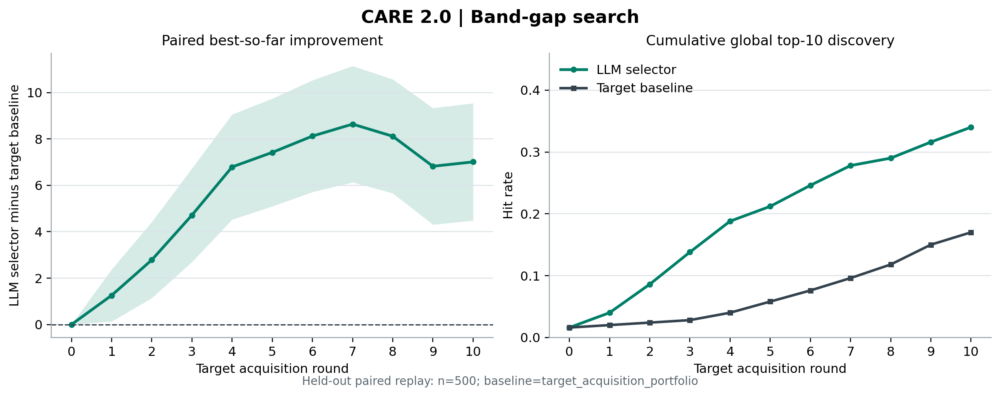
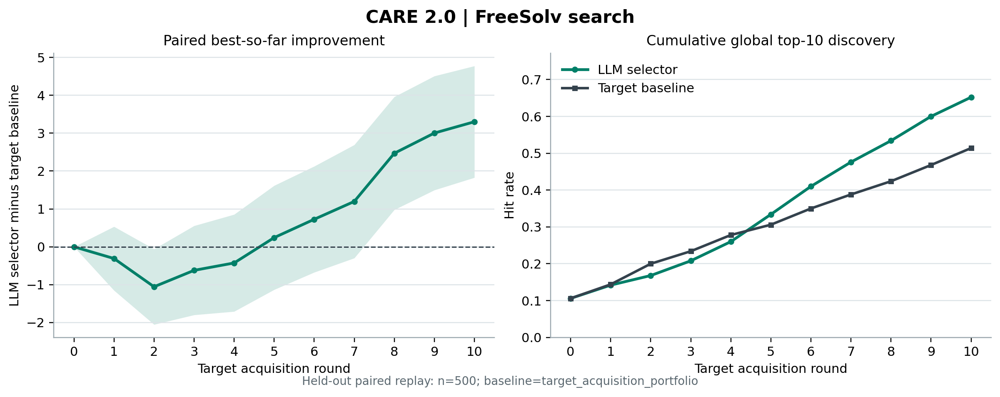
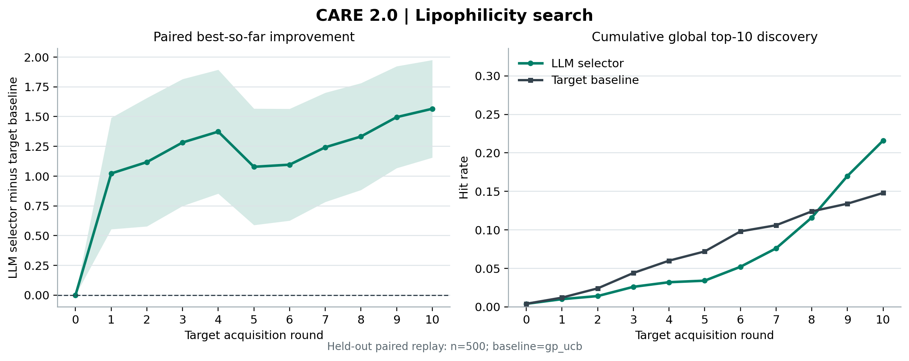

# LLM Evidence Causality and Round-Efficiency Audit

Date: 2026-07-21

## Question

This snapshot tests two claims that were still mixed together in the previous
semantic-skill results:

1. Does the gain come from supplied source-task evidence, or could the LLM have
   proposed the same useful representation from the target schema and its
   pretrained knowledge alone?
2. When an LLM skill helps, does it reduce the number of target experiments
   needed to find a high-value candidate?

The LLM compiles a public schema into executable rule features and an
acquisition schedule. A strict compiler rejects unknown fields and values. The
rule coefficients are then updated only from target outcomes revealed in
earlier replay rounds. Calibration can reject every LLM skill and fall back to
a target-only optimizer.

## Evidence Isolation

Every source-target pair uses three independently generated skill libraries:

- `full`: source identity, field map, outcome statistics, effects, support, and
  value priors;
- `source_schema_only`: source identity, objective, and public field alignment,
  with source outcomes removed;
- `target_only`: target schema plus the LLM's pretrained knowledge, with the
  source task completely withheld.

The reaction, materials, FreeSolv, and Lipophilicity development runs use the
same 30 calibration seeds (`16000-16029`) and 100 held-out seeds
(`16100-16199`). A selected skill is frozen before the 500-seed confirmation
range (`18000-18499`); 50 separate calibration seeds (`17000-17049`) select
only the target comparison anchor.

## Confirmed Results

The table reports paired deltas against the stated strong target-only baseline.
All rows use 500 fresh held-out seeds.

| Target | LLM evidence / selected skill | Baseline | Delta final best | Delta AUC | Delta top-10 hit |
| --- | --- | --- | ---: | ---: | ---: |
| Matbench band gap | target-only, `high_element_count`, no LLM coefficient prior | target portfolio | +7.0090 `[+4.4828, +9.5352]` | +6.1666 `[+4.3609, +7.9723]` | +0.170 `[+0.1270, +0.2130]` |
| MoleculeNet FreeSolv | source-schema, `branching_effect` | target portfolio | +3.3023 `[+1.8292, +4.7754]` | +0.8524 `[-0.1541, +1.8589]` | +0.138 `[+0.0867, +0.1893]` |
| MoleculeNet Lipophilicity | target-only, `high_aromatic_content`, no LLM coefficient prior | GP-UCB | +1.5660 `[+1.1563, +1.9757]` | +1.2607 `[+0.8914, +1.6300]` | +0.068 `[+0.0251, +0.1109]` |

The material and Lipophilicity rows establish a clean target-schema
generalization result: no source task was present in the LLM input, yet the
compiled representation improved a strong target-only optimizer on 500 fresh
seeds. This is evidence for useful LLM prior knowledge and representation
proposal, not source-to-target transfer.

FreeSolv is the narrower transfer result. `source_schema_only` beat the
target-only condition on the 100-seed development split by +4.9227 final best,
+2.4495 AUC, and +0.130 top-10 hit, with all three intervals above zero. The
500-seed frozen-skill result remained positive in final best and top-10 hit.
Because source outcomes were withheld, this supports transfer from source-task
identity and field alignment, not transfer of empirical source effects.

## Round Efficiency

`rounds_to_global_top10` is the first target acquisition round at which the
observed set contains a globally top-10 candidate. Initial-set hits count as
round 0; misses are right-censored at round 11. Positive values below mean the
LLM selector used fewer target acquisitions.

| Target | Baseline | Mean rounds saved to global top-10 | Best-so-far delta at round 5 |
| --- | --- | ---: | ---: |
| Matbench band gap | target portfolio | +1.354 `[+1.087, +1.621]` | +7.4178 `[+5.0985, +9.7370]` |
| FreeSolv | target portfolio | +0.478 `[+0.143, +0.813]` | +0.2419 `[-1.1316, +1.6155]` |
| Lipophilicity | GP-UCB | -0.076 `[-0.302, +0.150]` | +1.0783 `[+0.5893, +1.5672]` |

The round-saving claim is therefore target dependent. Band-gap and FreeSolv
find a global top-10 candidate earlier. Lipophilicity does not reduce the mean
first-hit round, but it produces better candidates by round 5 and a higher
eventual top-10 hit rate.

A stricter per-seed metric asks when the LLM reaches that seed's baseline
end-of-budget value. It is negative for all three headline runs. The LLM often
finds a different strong candidate early, but does not reliably reproduce the
baseline's exact endpoint on every seed. The report therefore does not use the
broader claim that LLM skills reduce every notion of sample complexity.

## What The Component Ablations Show

For band-gap search, removing the LLM-proposed coefficient direction improved
the result. The no-prior representation beat schedule-only by +4.9358 final
best, +5.1700 AUC, and +0.126 top-10 hit. The useful LLM contribution is the
`element_count_bin == ternary_quaternary` feature partition; target observations
should learn its direction and magnitude online.

For Lipophilicity, the no-prior rule representation beat schedule-only by
+1.2105 final best, +1.1949 AUC, and +0.058 top-10 hit. Again, the executable
partition is useful while the LLM's initial coefficient is unnecessary.

For FreeSolv, the full semantic skill beat schedule-only by +1.6319 final best
and +0.082 top-10 hit, while its AUC increment was not significant. Here the
semantic rule contributes beyond acquisition tuning, but the effect is less
uniform than in the target-only material and Lipophilicity cases.

## Negative and Null Results

- Suzuki to Buchwald-Hartwig: all three evidence conditions failed calibration
  and fell back to the target acquisition portfolio. There was no gain and no
  round saving.
- Dielectric to band gap: both source-conditioned libraries failed calibration;
  only the target-only library selected a useful skill. Source evidence did not
  cause the material gain.
- ESOL to Lipophilicity: full and source-schema skills were positive against the
  target portfolio, but the target-only skill was stronger on the development
  split. No incremental source-evidence claim is made.
- Across all four pairs, source outcome statistics never improved over the
  source-schema-only condition. The current outcome-summary prompt is not a
  validated transfer mechanism.

## Boundaries

One real CommonStack `openai/gpt-4o-mini` call generated each retained evidence
library. Twelve records are retained (39,237 tokens); two additional calls were
discarded after they exposed prompt-contract defects, which were then fixed and
tested. Generation-call variance was not replicated, so the source-evidence
comparison is a causal ablation of supplied information for these fixed calls,
not an estimate over arbitrary LLM generations.

The CommonStack endpoint was unreachable from the GPU server. Real LLM calls
were therefore made locally, while every calibration, held-out replay,
component ablation, and 500-seed confirmation ran on the server. API
credentials are not stored in this snapshot.

This is not an apples-to-apples leaderboard comparison with an external AI
Scientist. The defensible advantage is methodological: strong target-only BO
baselines, frozen held-out decisions, explicit evidence ablations, complete
per-round traces, and automatic fallback. External-system claims require those
systems to run on the same finite pools, budgets, and seeds.

## Files

- `headline_results.csv`: confirmed headline deltas and round-efficiency fields.
- `run_manifest.json`: model, evidence modes, seed ranges, execution boundary,
  and selected skills.
- `model_calls/`: retained prompt payloads, raw responses, normalized skills,
  token usage, and evidence boundaries.
- `raw_metrics/`: every per-mode, per-seed metric table.
- `raw_summaries/`: calibration decisions, paired CIs, source-evidence
  comparisons, and component ablations.
- `round_efficiency/`: censored round-to-threshold and early-budget summaries.
- `audit_archives/`: compressed per-round audit logs for every development and
  confirmation run.
- `figures/`: reproducible round-efficiency plots generated from the audits.

