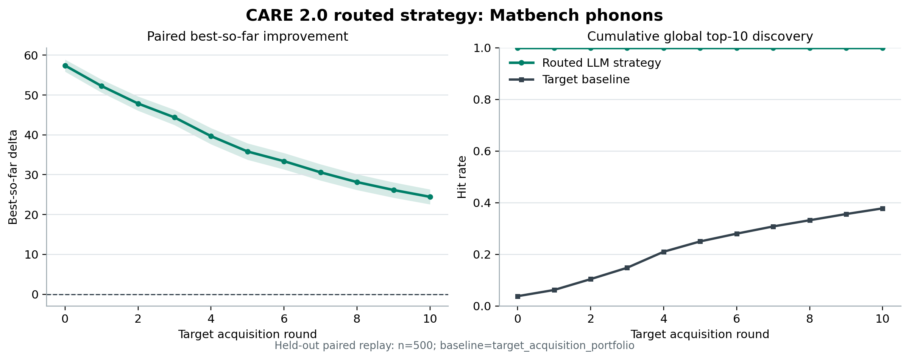
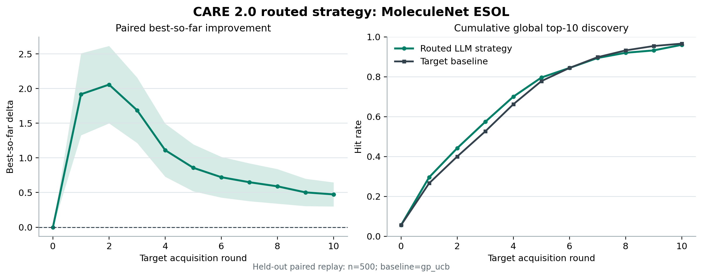
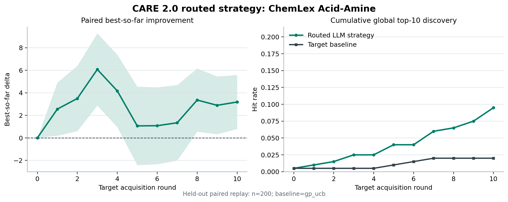

# 多领域 LLM Skill 与 Calibration Router 实验

日期：2026-07-22

## 结论

这一轮把 CARE 2.0 从“固定执行一种 LLM skill”改成了
calibration-only strategy router。LLM 先根据公开 target schema 生成可执行
skill；系统再用独立 calibration seeds，在以下四种执行方式中选一种：

1. target-only GP-UCB / GP-EI / acquisition portfolio；
2. 用 target observation 在线拟合规则系数的 semantic skill；
3. 保留 LLM 规则方向的 direct prior；
4. 用 LLM 规则选择初始实验点的 LLAMBO-style warm-start。

选择完成后，策略和 skill 都冻结，再进入 held-out replay。held-out 结果不会
反向影响策略选择。

预先纳入汇总的 9 个 target 条件中，6 个得到至少一项统计显著的正增益，
3 个由 router 回退到 target-only 方法。正结果覆盖材料性质、分子性质和真实
湿实验反应三个领域。这个结果支持“LLM 能从陌生任务 schema 提出有用的
实验策略”，但不能等同于 6 条 source-to-target transfer：其中只有
FreeSolv 的结果使用了 source-schema 信息，其余主要是 target-schema
generalization。

## 问题定义

每个数据集都被转成同一个 finite-pool replay：

- 候选点和真实实验结果已经存在；
- replay 开始时隐藏所有未观测结果；
- 每轮只能读取公开 descriptors 和之前已经 reveal 的 target observations；
- 方法选择一个候选点后，才 reveal 该点的真实结果；
- 最终比较相同 seeds、相同初始预算和相同 reveal rounds 下的搜索质量。

主要指标为：

- `final_best`：预算结束时找到的最好值；
- `AUC`：best-so-far 曲线面积，越高说明越早进入高价值区域；
- `top-10 hit`：是否找到全局前 10 个候选之一；
- `rounds saved`：相对 baseline 提前多少轮命中目标。

## LLM 输入和输出

本轮共保留 7 次真实 LLM 调用。输入只包含公开信息：

- target 任务目标、decision fields 和 descriptor catalog；
- `source_schema_only` 条件下的 source 身份和字段映射；
- 已入库的公开成功、失败和 gate-reject 经验；
- 严格 JSON 输出合同。

LLM 输出的是结构化 skill artifact，而不是候选结果：

- 可执行的规则条件；
- 规则方向和初始权重；
- semantic mass 和 GP-UCB / EI schedule；
- 适用范围、反例和置信度。

编译器会拒绝不存在的字段和值。运行阶段不会把未 reveal 的 target outcome
交给 LLM 或 semantic model。

## 冻结结果

表中均为 paired delta，baseline 是 held-out 上最强的 target-only 方法。

| Target | Router 选择 | Evidence | Seeds | Baseline | Final best | AUC | Top-10 hit |
| --- | --- | --- | ---: | --- | ---: | ---: | ---: |
| Matbench band gap | semantic `high_element_count` | target-only | 500 | target portfolio | +7.0090 `[+4.4828, +9.5352]` | +6.1666 `[+4.3609, +7.9723]` | +0.170 `[+0.1270, +0.2130]` |
| MoleculeNet FreeSolv | semantic `branching_effect` | source-schema | 500 | target portfolio | +3.3023 `[+1.8292, +4.7754]` | +0.8524 `[-0.1541, +1.8589]` | +0.138 `[+0.0867, +0.1893]` |
| MoleculeNet Lipophilicity | semantic `high_aromatic_content` | target-only | 500 | GP-UCB | +1.5660 `[+1.1563, +1.9757]` | +1.2607 `[+0.8914, +1.6300]` | +0.068 `[+0.0251, +0.1109]` |
| Matbench phonons | LLAMBO-style warm-start `light_nonmetal` | target-only | 500 | target portfolio | +24.4382 `[+22.5692, +26.3072]` | +36.2661 `[+34.6428, +37.8894]` | +0.622 `[+0.5795, +0.6645]` |
| MoleculeNet ESOL | semantic `low_hbond_donors` | target-only | 500 | GP-UCB | +0.4737 `[+0.3006, +0.6468]` | +1.0567 `[+0.8198, +1.2936]` | -0.006 `[-0.0240, +0.0120]` |
| ChemLex Acid-Amine | direct prior `low_acid_nitrogen` | target-only | 200 | GP-UCB | +3.1828 `[+0.7929, +5.5726]` | +2.9214 `[+0.6346, +5.2081]` | +0.075 `[+0.0360, +0.1140]` |

### Router 为什么重要

ChemLex 是最直接的例子。同一份 LLM skill 如果强制走 target-calibrated
semantic execution，AUC 相对 GP-UCB 为 -2.9725，95% CI 为
`[-5.2217, -0.7233]`。但是 calibration seeds 明确显示 direct prior 更适合
这个任务。router 冻结选择 direct prior 后，200 个新 seeds 上 final best、
AUC 和 top-10 hit 都显著为正。

Phonons 则相反。LLM 规则非常适合挑选初始实验点，calibration 因此选择
LLAMBO-style warm-start，而不是继续在线拟合同一条规则。这个策略在 held-out
上平均提前 8.534 轮命中全局 top-10。

ESOL 选择的是 target-calibrated semantic skill：LLM 提出“低 H-bond donor”
特征划分，方向和幅度由 reveal 的 target 数据在线拟合。它没有显著提高
top-10 hit，但从第 1、3、5 轮到最终结果，best-so-far 均显著高于 GP-UCB。

## 实验轮数

| Target | Router strategy | 提前命中全局 top-10 | 第 5 轮 best-so-far delta |
| --- | --- | ---: | ---: |
| Matbench phonons | LLM warm-start | +8.534 `[+8.216, +8.852]` | +35.8154 `[+33.7505, +37.8803]` |
| MoleculeNet ESOL | calibrated semantic | +0.132 `[-0.099, +0.363]` | +0.8574 `[+0.5190, +1.1959]` |
| ChemLex Acid-Amine | direct prior | +0.325 `[+0.118, +0.532]` | +1.0644 `[-2.4060, +4.5348]` |

ChemLex 对“达到同 seed 下 GP-UCB 最终值”的严格阈值没有节省轮数，均值为
-1.405；它的优势体现在更早命中全局 top-10，以及最终找到更好的候选。报告
因此不使用“所有质量阈值都降低 sample complexity”的表述。

## 失败和回退

- Suzuki / source-schema -> Buchwald-Hartwig：所有 LLM execution strategy
  都没有通过 calibration，router 选择 GP-UCB。
- source-schema -> ChemLex：router 选择 GP-UCB；在 20 个 held-out seeds 上，
  GP-UCB 还低于 descriptive strongest portfolio，说明当前 source mapping
  没有提供可靠迁移。
- Matbench log bulk modulus：router 选择 calibration anchor GP-EI；相对
  held-out strongest portfolio 没有显著优势。
- ChemLex 的 forced semantic execution 是负结果，但 direct prior 能被
  calibration 正确识别并保留。

这些结果说明 fallback 不是装饰。当前 reaction HTE 的 source evidence
仍然不够好，不能为了“全领域提升”强行把 LLM skill 接管 target optimizer。

## 外部 LLM Baseline 的边界

`LLM direct prior` 和 `LLAMBO-style warm-start` 是放到同一 finite-pool、
相同预算和相同 seeds 下的适配版，不是对原论文完整系统的复现。它们的作用是
检验：同一份 LLM 规则是应该直接执行、只用于 warm-start，还是交给 CARE
在线校准。

因此本轮最稳妥的系统级结论是：CARE 2.0 的优势来自统一协议、calibration
router、自动 fallback、逐轮 audit 和知识沉淀。不能把 phonons 上选中
LLAMBO-style warm-start 写成“CARE 算法击败 LLAMBO”；更准确的说法是，
CARE 平台能在 held-out 之前识别出哪种 LLM 使用方式适合当前任务。

## 可复现文件

- `multidomain_report.json/csv`：9 个预设 target 条件的统一汇总；
- `headline_results.csv`：6 个冻结正结果；
- `run_manifest.json`：模型、seed、执行边界和策略选择；
- `model_calls/`：完整 prompt、response、usage 和 normalized skills；
- `raw_metrics/`：每个 mode、每个 seed 的结果；
- `raw_summaries/`：calibration、router、paired CI 和 external comparison；
- `round_efficiency/`：轮数和 early-budget 审计；
- `audit_archives/`：逐轮、逐 seed audit log；
- `figures/`：从 audit log 重建的图。

本轮使用的原始数据已经由仓库统一管理在
[`../../data/raw`](../../data/raw/)，包括 ChemLex wetlab、MoleculeNet、
Matbench 和 reaction HTE 文件；结果目录不再重复复制一份。
