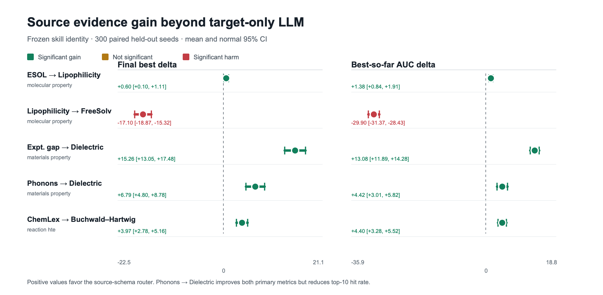

# Source-schema 迁移扩展验证

日期：2026-07-23

## 结论

这一轮专门回答一个比“LLM 能不能赢 BO”更严格的问题：

> 在 target schema 和实验预算完全相同的情况下，加入 source task 的公开
> schema、目标语义和字段映射，能否比 target-only LLM skill 做得更好？

5 条 source-target 路径都在独立的 300 个 held-out seeds 上完成了配对验证。
其中 4 条在 `final_best` 或 best-so-far AUC 上有统计显著的 source 增量，
覆盖分子性质、材料性质和反应 HTE 三类任务。Lipophilicity → FreeSolv 是
明确负迁移，完整保留在结果中。

另外，source-schema router 在 5/5 条路径上都显著优于 held-out 上最强的
target-only BO。target-only LLM 自身则在 4 个唯一 target 中的 3 个上优于
最强 BO；Buchwald–Hartwig 的 target-only router 回退到了 GP-UCB。



## Source 相对 target-only LLM

表中是 source-schema router 减去 matched target-only LLM router 的配对差值。
每个条件均为 300 个 held-out seeds，括号内为 normal 95% CI。

| Source → target | 执行方式 | Final best | AUC | Top-10 hit | 判断 |
| --- | --- | ---: | ---: | ---: | --- |
| ESOL → Lipophilicity | LLM warm-start | +0.602 `[+0.096, +1.108]` | +1.376 `[+0.841, +1.911]` | -0.050 `[-0.119, +0.019]` | 正迁移 |
| Lipophilicity → FreeSolv | LLM direct prior | -17.099 `[-18.873, -15.324]` | -29.902 `[-31.373, -28.432]` | -0.187 `[-0.231, -0.143]` | 负迁移 |
| Matbench expt. gap → dielectric | LLM warm-start | +15.265 `[+13.052, +17.478]` | +13.085 `[+11.892, +14.278]` | +0.203 `[+0.131, +0.276]` | 正迁移 |
| Matbench phonons → dielectric | LLM direct prior | +6.789 `[+4.799, +8.779]` | +4.416 `[+3.013, +5.819]` | -0.213 `[-0.267, -0.159]` | 主指标提升，top-10 有代价 |
| ChemLex → Buchwald–Hartwig | LLM direct prior | +3.971 `[+2.777, +5.164]` | +4.398 `[+3.277, +5.519]` | +0.193 `[+0.130, +0.256]` | 正迁移 |

`Phonons → dielectric` 不能表述成全面提升。它提高了预算结束时的最好值和
整条搜索曲线的 AUC，但更少命中全局 top-10。更准确的解释是：source skill
改变了搜索偏好，带来更高平均收益，同时牺牲了极值命中率。

## 实验轮数

下面比较 source-schema router 和各自最强 BO。正的 rounds saved 表示使用了
更少 target acquisitions；未命中的 run 按第 11 轮右删失。

| Source → target | 达到 BO 最终值节省轮数 | 命中全局 top-10 节省轮数 | 第 5 轮 best delta |
| --- | ---: | ---: | ---: |
| ESOL → Lipophilicity | -0.480 `[-1.134, +0.174]` | +0.220 `[-0.129, +0.569]` | +2.804 `[+2.110, +3.497]` |
| Lipophilicity → FreeSolv | +1.003 `[+0.534, +1.472]` | +2.457 `[+1.966, +2.947]` | +12.140 `[+9.883, +14.397]` |
| Matbench expt. gap → dielectric | +3.887 `[+3.257, +4.516]` | +0.923 `[+0.662, +1.185]` | +12.883 `[+11.559, +14.207]` |
| Matbench phonons → dielectric | +0.650 `[+0.205, +1.095]` | +0.067 `[-0.193, +0.327]` | +7.007 `[+5.336, +8.679]` |
| ChemLex → Buchwald–Hartwig | -0.337 `[-0.829, +0.156]` | +1.310 `[+0.908, +1.712]` | +4.792 `[+3.249, +6.335]` |

所有 5 条路径在第 5 轮都显著优于各自最强 BO，但“达到 BO 最终值”的严格
轮数指标只在 3/5 条路径显著节省。ESOL → Lipophilicity 和 ChemLex →
Buchwald–Hartwig 的优势主要体现为更高的早期 best-so-far；后者还显著提前
命中全局 top-10。

## 实验边界

使用的 target 都来自真实公开数据：

- MoleculeNet：Lipophilicity、FreeSolv；
- Matbench：dielectric；
- reaction HTE：Buchwald–Hartwig。

source 侧使用 ESOL、Lipophilicity、Matbench expt. gap、Matbench phonons 和
ChemLex Acid-Amine 的公开任务描述与 schema。`source_schema_only` 不包含
source labels 或 target outcomes，因此这里验证的是 semantic/schema transfer，
不是把 source 标签直接当作 target 标签，也不是跨数据集训练一个监督模型。

每个 replay 从 5 个初始 target observations 开始，再执行 10 轮选择。所有
候选结果在被选择前都保持隐藏。LLM 只在生成 skill artifact 时真实调用，
replay 期间执行的是冻结后的结构化 skill，不会逐轮偷看未 reveal 的结果。

## 冻结与确认

本轮共保留 9 次真实 `deepspeek-v3.2` 调用：5 个 source-schema records，
以及每个唯一 target 对应的 4 个共享 target-only records。

1. Development：30 个 calibration seeds 和 50 个 held-out seeds，用于选择
   skill identity。
2. Confirmation：skill identity 固定后，50 个新 calibration seeds 只选择
   execution strategy 和 target-only anchor。
3. Final evaluation：300 个新 held-out seeds；不再改 prompt、skill、router
   threshold 或 pair membership。

初始 pair membership 和 confirmation seed range 在模型选择前已经确定；
screening seed 数和共享 target-only 记账方式是在 runtime smoke test 后
最终确定，因此本目录不把整套流程称为“完全预注册实验”。

## Baseline

每个 seed 都同时运行以下方法：

- GP-UCB；
- mixed-kernel GP-EI；
- target acquisition portfolio；
- target-only LLM semantic skill；
- LLM direct prior；
- LLAMBO-style warm-start；
- CARE strategy router。

“最强 BO”按 held-out 上的描述性最优方法报告；router 自身只使用 calibration
数据做选择。external LLM baselines 是同一 finite-pool、预算和 seed 下的
适配实现，不代表复现其论文中的完整系统。

## 可复核文件

- `extension_report.json/csv`：统一的配对结果和 95% CI；
- `run_manifest.json`：模型、seed、预算、文件对应关系和冻结边界；
- `model_calls/`：完整 prompt、response、usage 和 normalized skills；
- `raw_metrics/`：screening 与 confirmation 中每种方法、每个 seed 的指标；
- `raw_summaries/`：calibration 选择、router 路由和 held-out 统计；
- `audit_archives/`：14 个按 run 分组的压缩包，包含 9 个 confirmation 条件
  的 router trace，以及 5 个 source 条件对应的 strong-BO trace；
- `round_efficiency/`：source 相对 strong BO 和 target-only LLM 的阈值轮数、
  top-10 命中与早期预算分析；
- `logs/`：LLM 生成和 replay 标准输出；
- `SHA256SUMS`：可在当前目录直接使用的相对路径 checksum manifest；
- `SERVER_SHA256SUMS`：服务器打包时生成并在下载后通过验证的原始 manifest。

重新生成汇总和矢量图：

```bash
python3 experiments/care_replay/scripts/build_semantic_transfer_extension_report.py \
  --manifest experiments/care_replay/results/2026-07-23-source-evidence-extension/run_manifest.json \
  --output-dir experiments/care_replay/results/2026-07-23-source-evidence-extension

python3 experiments/care_replay/scripts/plot_semantic_transfer_extension.py \
  --report experiments/care_replay/results/2026-07-23-source-evidence-extension/extension_report.json \
  --output experiments/care_replay/results/2026-07-23-source-evidence-extension/figures/source_evidence_forest.svg
```
