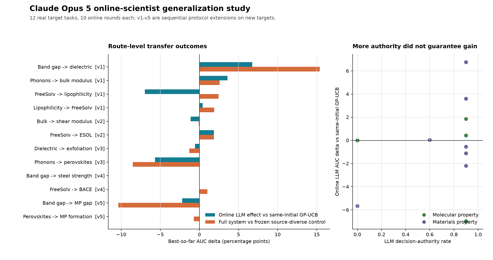

# Claude Opus 5 online-scientist generalization study

This archive extends the online LLM scientist from chemistry into real
molecular-property and materials-property finite-pool tasks. It records 12 new
source-target routes, 120 online target reveals, and every model request,
structured response, selected candidate, and revealed outcome.

## Evidence boundary

The five protocol versions form a sequential development study. Each version
was frozen before its own new target tasks were run, but later versions were
designed after inspecting earlier failures. The combined table is therefore a
stress test of generalization, not one preregistered confirmatory experiment.
Target outcomes were hidden until candidate selection, target reveal budgets
were matched, and the primary comparator used the same LLM-generated initial
design followed by target-only GP-UCB.

## Main result

Claude Opus 5 participated in all 120 online rounds with no API or structured
output errors. Its mean decision-authority rate was 65%; participation and
authority are reported separately because a safety route can call the LLM while
executing target-GP rank one.

Across all routes, the online LLM step changed best-so-far AUC by `-0.3223`
points on average relative to same-initial GP-UCB (5 wins, 2 ties, 5 losses).
The complete LLM scientist changed AUC by `+0.3518` points relative to the
frozen source-diverse control (6 wins, 1 tie, 5 losses). Neither aggregate sign
test is significant. Molecular routes were more consistent: the full system
improved AUC on all four molecular targets, with mean delta `+1.8052`. Materials
routes remained mixed and exposed large negative-transfer cases.

The defensible conclusion is route-specific generalization, not universal
cross-domain improvement. LLM initial design and hypothesis generation are
useful on several paths; unconstrained online reranking is not yet reliably
better than target-only GP-UCB.

## Protocol evolution

| Version | New-target policy | What it tested |
| --- | --- | --- |
| v1 | Original consensus menu | Direct extension of the chemistry controller |
| v2 | Respect the LLM transfer-stop decision | Whether the controller can abandon a bad source prior |
| v3 | Execute GP rank one after transfer stop | Whether a deterministic fallback removes reranking damage |
| v4 | Require consensus rank <=2 and target-GP rank <=5 | Conservative evidence intersection |
| v5 | Transfer intersection or LLM reranking within target-GP top three | Bounded decision authority on large unseen targets |

## Task-level AUC deltas

| Route | Version | Online LLM vs same-initial GP | Full system vs frozen control |
| --- | --- | ---: | ---: |
| Band gap -> dielectric | v1 | +6.7452 | +15.3780 |
| Phonons -> bulk modulus | v1 | +3.5908 | +2.5771 |
| FreeSolv -> lipophilicity | v1 | -6.9750 | +2.4500 |
| Lipophilicity -> FreeSolv | v1 | +0.4223 | +1.8920 |
| Bulk -> shear modulus | v2 | -1.1241 | -0.0746 |
| FreeSolv -> ESOL | v2 | +1.8571 | +1.8571 |
| Dielectric -> exfoliation energy | v3 | -0.5552 | -1.2856 |
| Phonons -> perovskites | v3 | -5.6721 | -8.5032 |
| Band gap -> steel strength | v4 | 0.0000 | 0.0000 |
| FreeSolv -> BACE | v4 | 0.0000 | +1.0215 |
| Band gap -> MP gap | v5 | -2.1961 | -10.3685 |
| Perovskites -> MP formation energy | v5 | +0.0394 | -0.7227 |

## Archive layout

- `aggregate/generalization_summary.json`: aggregate and grouped metrics.
- `aggregate/generalization_metrics.csv`: one row per source-target route.
- `figures/`: publication-ready PNG and PDF visualizations.
- `v*/<case>/initial_record.json`: outcome-blind initial-design request and response.
- `v*/<case>/llm_trace.jsonl`: online requests, responses, selections, and reveals.
- `v*/<case>/summary.json`: matched-budget metrics and deltas.
- `run_manifest.json`: frozen configurations and reconstruction commands.
- `data_manifest.json`: public download URLs, file sizes, and SHA-256 hashes.
- `SHA256SUMS`: integrity hashes for the complete archive.

The trace stores model-visible evidence and structured rationales. It does not
claim to expose private chain-of-thought.
