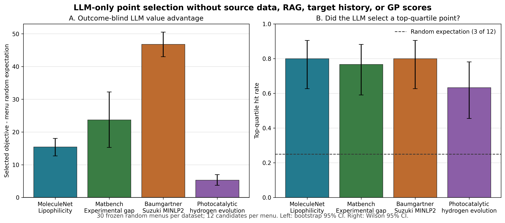

# LLM zero-experience point-selection ablation

## Question

Can the LLM select a promising experimental point using only the candidate descriptions, without seeing source experiments, target outcomes, RAG, saved skills, or GP scores?

This experiment isolates the model's pretrained scientific prior from CARE 2.0's transfer machinery. It is therefore an ablation, not a source-to-target transfer result.

## Frozen protocol

- Model: Opus 5 through the configured CommonStack endpoint, temperature 0.
- Data: four real public datasets covering molecular property, materials, reaction optimization, and photocatalysis.
- Evaluation unit: one frozen menu containing 12 candidates.
- Repeats: 30 independently frozen menus per dataset, 120 decisions in total.
- Prompt boundary: opaque within-menu IDs and candidate descriptors only.
- Hidden until after selection: source identity and outcomes, target history and outcomes, RAG/knowledge-base content, stored skills, GP/acquisition scores, and original row IDs.
- Primary comparison: selected hidden objective minus the exact mean objective of all 12 candidates in the same menu.
- Secondary comparisons: top-quartile hit rate, top-one hit rate, and a descriptor-space-filling selector.
- Uncertainty: 100,000 menu-level bootstrap resamples for the value difference; Wilson intervals for hit rates in the figure.

The protocol was executed on commit `d7a0c38`. All 24 final model batches succeeded. The aggregate contains 120 decisions and the corresponding model traces.

## Result

The objective scales differ across datasets, so value differences should be read within a row and must not be averaged across rows.

| Dataset | LLM - random menu expectation | Bootstrap 95% CI | Top-quartile hit | Top-one hit | Menus above random |
| --- | ---: | ---: | ---: | ---: | ---: |
| MoleculeNet Lipophilicity | +15.44 | [12.71, 18.05] | 80.0% | 36.7% | 28/30 |
| Matbench experimental band gap | +23.73 | [15.27, 32.22] | 76.7% | 46.7% | 22/30 |
| Baumgartner Suzuki MINLP2 | +46.81 | [43.01, 50.50] | 80.0% | 33.3% | 30/30 |
| Photocatalytic hydrogen evolution | +5.33 | [3.73, 6.98] | 63.3% | 16.7% | 26/30 |

All four within-dataset bootstrap intervals are above zero. The LLM also exceeded the frozen space-filling selector on all four datasets; those estimates and intervals are in `summary.json`.

## Interpretation

Under this one-step, finite-menu protocol, the model can use descriptors alone to enrich for higher-valued candidates across four task types. The result supports using an LLM as a scientific prior or proposal component. It does not show that the LLM can run a full sequential campaign, outperform GP-UCB, or perform source-outcome transfer by itself.

All four datasets are public. Pretraining exposure cannot be ruled out, so this experiment is not evidence of clean out-of-distribution generalization. The prospective wet-lab panel in the companion handoff is the stronger next test because its outcomes are not available to the model at decision time.

## Files

- `summary.json`: aggregate protocol, per-dataset estimates, usage, and claim boundary.
- `decisions.csv`: one row per frozen menu and selected hidden outcome.
- `llm_trace.jsonl`: complete successful prompt/response traces for audit.
- `protocol_lock.json`: execution and file hashes used to identify the frozen run.
- `shards/`: original per-dataset outputs copied from the experiment server.
- `zero_experience_results.png` and `.pdf`: Matplotlib plots generated from `decisions.csv` and `summary.json`.

Recorded usage for the 24 successful final calls was 502,646 prompt tokens and 99,658 completion tokens. Interrupted engineering preflights were excluded from the result files, so provider billing can be higher than this recorded total.
