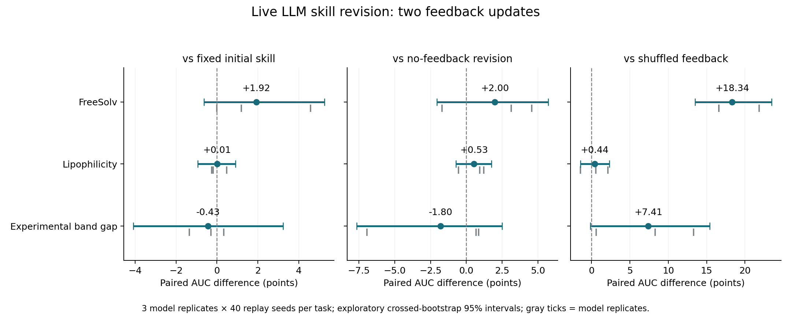

# Live LLM RSI feedback experiment

This experiment executes new CommonStack Claude Opus 5 calls to revise executable skills twice. It compares true-feedback revisions against a shared frozen initial skill, equally frequent revisions without measured feedback, and revisions with swapped skill-feedback bindings.

## Measured held-out AUC effects

| Task | True feedback − fixed | True − no feedback | True − shuffled | True − GP |
| --- | --- | --- | --- | --- |
| FreeSolv | +1.9169 [-0.6340, +5.2569] | +1.9952 [-2.0448, +5.7073] | +18.3352 [+13.4772, +23.4572] | +12.7207 [+8.2872, +17.4611] |
| Lipophilicity | +0.0090 [-0.9346, +0.9035] | +0.5321 [-0.7358, +1.7569] | +0.4374 [-1.4366, +2.3597] | +2.6466 [+1.0956, +4.2039] |
| Experimental band gap | -0.4323 [-4.0851, +3.2332] | -1.8022 [-7.6500, +2.5035] | +7.4101 [-0.1194, +15.4241] | +24.9977 [+17.9339, +32.5485] |

### First versus second update (secondary diagnostic)

| Task | Second − first true-feedback update | Model-replicate means |
| --- | --- | --- |
| FreeSolv | +0.2106 [-3.0614, +3.0524] | -2.3712, +1.4557, +1.5473 |
| Lipophilicity | +1.1040 [+0.2461, +2.0866] | +1.4816, +1.0247, +0.8056 |
| Experimental band gap | -0.8249 [-4.2282, +2.9795] | -1.4997, +0.3391, -1.3141 |

This additional diagnostic was locked during generation, before any final held-out case metrics existed. It requires 360 extra replay trajectories and no extra model calls; it is not a primary endpoint.

Intervals are exploratory 95% crossed-bootstrap intervals. Each task has only three independent initial model runs with paired revision arms and 40 common replay seeds. Model-call uncertainty remains weakly estimated. Familywise intervals for the three primary task comparisons are in `summary.json`; other contrasts are descriptive.



## Execution and trace boundary

- 74 generation attempts, 63 valid generations, 11 failed attempts retained.
- API usage reported for these generation attempts: 489082 input, 179658 output, 668740 total tokens. This is not an invoiced-dollar estimate.
- 2808 actual finite-pool trajectories: 648 development, 1800 primary held-out evaluation and 360 secondary diagnostic evaluation. Each uses 5 initial observations + 10 reveals.
- The initial model draw is shared among arms within each replicate. Each revised arm has two new calls; frozen initial has none. Development/revision overhead is extra relative to the frozen arm.
- All initial candidate IDs, selected candidates, revealed measured values, model prompts and raw responses, normalized skills, memories, revisions and deployment locks are retained.
- Model-selected final skill IDs are frozen before held-out execution. No held-out seed metrics appear in feedback prompts.
- Two skills are evaluated per development generation. True feedback attaches scores to the correct skill; the shuffled arm swaps the two bindings. No-feedback receives its previous proposals but no measured development summaries.
- The end-of-generation memory and executable skill states are experimental artifacts; no global active KB promotion or weight training occurs.

## What this can and cannot show

A gain over frozen initial alone can reflect extra inference or stochastic proposal variation. The no-feedback and shuffled-feedback contrasts are required to assess whether real measured feedback adds value. All tasks and finite data pools have appeared in earlier development. This is a same-task, seed-disjoint component test, not new-task confirmation or wet-lab evidence. It does not evaluate production KB retrieval. The frozen arm is the initial live-generated skill, not the separate historical CARE fixed-v2 warmstart controller.

Numerical warnings were recorded for 2507 trajectories. Saved deployment metrics, finite selected scores, paired initial observations and reveal budgets were checked by this reporter.
For backend sample checks see `numerical_validation.json` when present. Failed API/format attempts are not silently counted as valid model generations.

## Reproduction

Use the versions in `requirements.txt` and configure `COMMONSTACK_API_KEY` in the environment. Then:

```bash
python experiments/care_replay/scripts/run_rsi_live_feedback.py \
  --config experiments/care_replay/configs/rsi_live_feedback_v1.json \
  --output-dir /tmp/care-rsi-live-reproduction --workers 3
python experiments/care_replay/scripts/evaluate_rsi_first_update.py --root /tmp/care-rsi-live-reproduction
python experiments/care_replay/scripts/report_rsi_live_feedback.py \
  --root /tmp/care-rsi-live-reproduction
```

Live regeneration is stochastic and can vary with provider/model changes. Archived prompt/response and replay records are the exact evidence for this run. Replay seeds do not imply a deterministic LLM seed.
