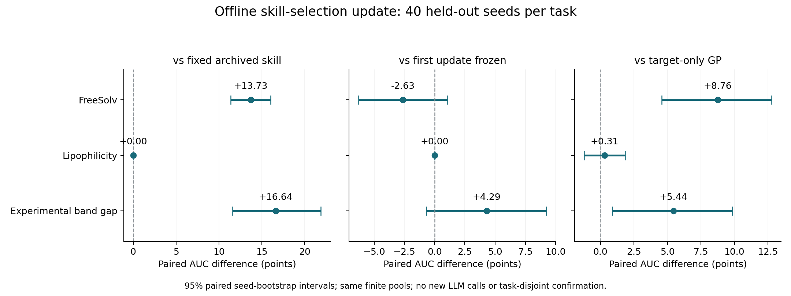

# RSI memory component: actual replay results

The skill selector was updated in three development rounds using archived LLM proposals. This is an offline selection component, not a completed KB-to-LLM recursive self-improvement experiment.

## Held-out result

| Task | Fixed AUC | Updated AUC | Paired delta [95% CI] | Familywise interval* | Seed W/T/L | Final-best delta [95% CI] |
| --- | ---: | ---: | --- | --- | --- | --- |
| FreeSolv | 52.1764 | 65.9019 | +13.7255 [+11.3644, +16.0223] | [+10.8731, +16.5063] | 38/2/0 | +7.2283 [+4.2975, +10.2842] |
| Lipophilicity | 85.5916 | 85.5916 | +0.0000 [+0.0000, +0.0000] | [+0.0000, +0.0000] | 0/40/0 | +0.0000 [+0.0000, +0.0000] |
| Experimental band gap | 39.2284 | 55.8697 | +16.6413 [+11.5894, +21.8973] | [+10.4908, +23.1515] | 32/3/5 | +28.0156 [+19.6498, +36.4157] |

*Bonferroni-adjusted percentile bootstrap intervals across three primary task AUC comparisons (98.33% marginal coverage; bootstrap approximation, not exact finite-sample coverage). Secondary comparisons below are descriptive. Intervals are conditional on the fixed development sample and archived skills. They do not account for new-task or new-LLM-draw variability.

## Attribution controls

| Task | Updated − first update frozen | Updated − same-feedback batch | Updated − shuffled feedback | Updated − GP |
| --- | --- | --- | --- | --- |
| FreeSolv | -2.6340 [-6.2880, +1.0503] | +0.0000 [+0.0000, +0.0000] | -0.4792 [-3.0881, +2.3199] | +8.7607 [+4.5847, +12.7814] |
| Lipophilicity | +0.0000 [+0.0000, +0.0000] | +0.0000 [+0.0000, +0.0000] | +1.7903 [+0.5056, +3.1707] | +0.3116 [-1.2278, +1.8403] |
| Experimental band gap | +4.2909 [-0.6857, +9.2301] | +0.0000 [+0.0000, +0.0000] | +9.2575 [+3.6884, +14.6860] | +5.4428 [+0.8746, +9.8486] |

The cumulative updater and same-feedback batch selector select the same final skill. Their paired delta is exactly zero. Thus this experiment cannot attribute any improvement over the initial fixed choice to recursion itself, novel skill generation, or weight learning.



## Protocol and cost

- Three development generations × 10 seeds; 40 separate evaluation seeds per task.
- Every trajectory uses identical paired initial observations and 10 additional reveals (15 observations total).
- All archived normalized skills were included: no skill was removed after observing results.
- Fixed choice: highest archived confidence, then lexicographic ID. Update: cumulative development AUC, incumbent retained on exact ties.
- Selection locks and hash-linked version states precede evaluation on each task; held-out seeds never update the bank.
- Bootstrap: 20,000 paired resamples, seed 20260909.

Executed 1660 trajectories: 660 development and 1000 evaluation. Development alone costs 9900 replay observations across skill arms. These are offline evaluations of measured datasets, not new wet-lab measurements. The fixed arm does not need this development expense; only the same-feedback batch control is development-budget matched.

New LLM calls: **0**. Three existing prompt/raw-response records are retained under `archived_llm_traces/`, with original paths and SHA-256 in each task provenance file. No model-call uncertainty can be estimated from one archived proposal set per task.

## Failures and limitations

- The first launch failed before completing any trajectory because tuple-valued normalized conditions were not round-tripped through JSON before worker normalization. The failure is retained under `failed_attempts/`; the corrected serialization has a regression test.
- 1540 completed trajectories emitted NumPy numerical warnings. Warnings are retained per trajectory. All recorded metrics and selected scores are finite; see `numerical_validation.json` for independent backend checks.
- Each task and its finite candidate pool have appeared in prior development. Seed disjointness does not mean task disjointness; positive intervals do not establish generalization.
- No global candidate skill is promoted to active knowledge. Full fixed-KB versus updating-KB LLM experiments remain pending safe environment credentials and a frozen task-disjoint protocol.

## Reproduction

From the repository root, with Python and the versions in `requirements.txt`:

```bash
python experiments/care_replay/scripts/run_rsi_memory_component.py \
  --config experiments/care_replay/configs/rsi_memory_component_v1.json \
  --output-dir /tmp/care-rsi-memory-reproduction --workers 3
python experiments/care_replay/scripts/report_rsi_memory_component.py \
  --root /tmp/care-rsi-memory-reproduction
```

`raw_metrics.csv` is the complete per-skill/per-seed table. Task folders contain initial reveals, every subsequent selected candidate and measured value, skill snapshots, warnings, versioned selection banks, selection locks, dataset hashes and statistical summaries. `protocol_lock.json` records the base commit, implementation hashes, config and runtime. `AUDIT.md` records the prior implementation audit.
