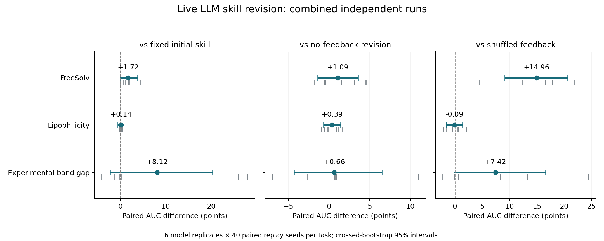

# CARE 2.0 / RSI 六模型重复合并结果

旧实验和本次扩展各有 3 个独立模型重复。合并分析使用 6 个模型重复，并在每个模型重复内保留相同的 40 个配对回放种子。

| 任务 | 真反馈 − 固定初始策略 | 真反馈 − 无反馈修订 | 真反馈 − 打乱反馈 | 真反馈 − GP-UCB |
| --- | ---: | ---: | ---: | ---: |
| FreeSolv | +1.7213 [-0.0775, +3.7845] | +1.0920 [-1.3778, +3.6053] | +14.9627 [+9.1525, +20.6721] | +12.9236 [+8.6700, +17.5796] |
| Lipophilicity | +0.1355 [-0.5764, +0.7861] | +0.3865 [-0.6468, +1.4394] | -0.0925 [-1.5485, +1.4002] | +2.6074 [+1.4223, +3.8426] |
| Experimental band gap | +8.1246 [-2.2526, +20.3055] | +0.6555 [-4.2655, +6.5196] | +7.4179 [-0.1835, +16.6253] | +24.6877 [+18.4070, +31.2396] |

## 主要结论

- **FreeSolv 是目前最一致的 RSI 信号。** 真反馈相对固定初始策略为 +1.7213 [-0.0775, +3.7845]，区间只略微跨过 0；相对打乱反馈为 +14.9627 [+9.1525, +20.6721]。但相对无反馈仍为 +1.0920 [-1.3778, +3.6053]，所以反馈归因还不完整。
- **Lipophilicity 没有稳定的 RSI 净增益。** 真反馈相对固定初始策略为 +0.1355 [-0.5764, +0.7861]，相对无反馈和打乱反馈也都跨 0。
- **带隙结果有明显批次差异。** 合并后相对固定初始策略为 +8.1246 [-2.2526, +20.3055]，但旧 3 次接近 0、新 3 次很大，且相对无反馈仍跨 0，暂时不能当作稳定收益。
- 三个任务中真反馈策略都优于 GP-UCB，但这个对照同时包含初始技能本身的优势，不能单独证明两次反馈更新有效。

## 分时间批次检查

下表保留旧实验与新扩展的真反馈相对固定初始策略均值，防止合并结果掩盖模型或服务商随时间变化。

| 任务 | 旧 3 次 | 新 3 次 |
| --- | ---: | ---: |
| FreeSolv | +1.9169 | +1.5256 |
| Lipophilicity | +0.0090 | +0.2620 |
| Experimental band gap | -0.4323 | +16.6816 |

## 怎么解释

- 真反馈相对固定初始策略回答“经过两次更新后是否更好”。
- 真反馈相对无反馈和打乱反馈回答“收益是否来自正确的实验反馈”。只有三项一起成立，才适合把增益归因于反馈驱动 RSI。
- 置信区间按模型重复和回放种子交叉重采样。40 个回放种子不能当成 40 次独立模型实验。

## 执行记录

- 126 次有效生成，150 次总尝试，24 次失败尝试已保留。
- API 共报告 1416226 tokens。
- 1296 条开发轨迹，3600 条主要测试轨迹，720 条第一次更新诊断轨迹。
- 本次扩展没有训练模型权重；权重训练属于另一个待验证实验臂。

## 证据边界

每个任务合并了 6 条独立模型重复链，每条链使用 40 个配对回放种子。由于模型服务状态和执行时间不同，旧实验与新扩展仍需分开报告。三个有限候选池任务都曾参与开发，因此这不是任务隔离验证、前瞻实验或湿实验结果。

旧实验在生成过程中锁定了第一次与第二次更新对照；新扩展在主要运行完成后才补算。因此合并后的更新次数结果属于事后描述，不能当成预注册终点。
