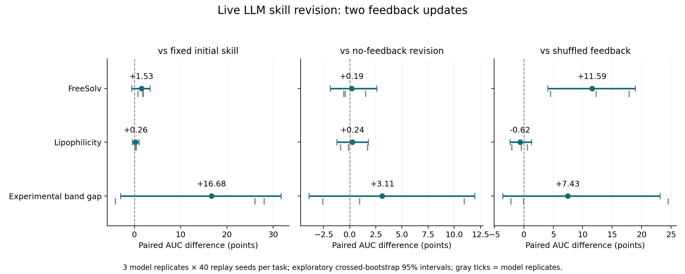

# Live LLM RSI feedback experiment

This experiment executes new CommonStack Claude Opus 5 calls to revise executable skills twice. It compares true-feedback revisions against a shared frozen initial skill, equally frequent revisions without measured feedback, and revisions with swapped skill-feedback bindings.

## Measured held-out AUC effects

| Task | True feedback − fixed | True − no feedback | True − shuffled | True − GP |
| --- | --- | --- | --- | --- |
| FreeSolv | +1.5256 [-0.5868, +3.3815] | +0.1889 [-1.8611, +2.5843] | +11.5902 [+4.0529, +18.8995] | +13.1266 [+8.5983, +18.0876] |
| Lipophilicity | +0.2620 [-0.4777, +1.0100] | +0.2408 [-1.2296, +1.7850] | -0.6224 [-2.3826, +1.2847] | +2.5683 [+1.4043, +3.7351] |
| Experimental band gap | +16.6816 [-3.0152, +31.7054] | +3.1131 [-3.8951, +11.9541] | +7.4257 [-3.6177, +23.1148] | +24.3776 [+17.8819, +31.0813] |

### First versus second update (secondary diagnostic)

| Task | Second − first true-feedback update | Model-replicate means |
| --- | --- | --- |
| FreeSolv | -0.4191 [-2.4066, +2.0689] | -0.8509, -1.4828, +1.0764 |
| Lipophilicity | +0.0590 [-0.2426, +0.5273] | +0.2634, -0.0866, +0.0000 |
| Experimental band gap | +4.5830 [-2.4218, +13.9072] | +0.7144, +13.9331, -0.8984 |

This additional diagnostic was added after the primary run completed. It requires 360 extra replay trajectories and no extra model calls; it is descriptive and not a preregistered endpoint.

Intervals are exploratory 95% crossed-bootstrap intervals. Each task has only three independent initial model runs with paired revision arms and 40 common replay seeds. Model-call uncertainty remains weakly estimated. Familywise intervals for the three primary task comparisons are in `summary.json`; other contrasts are descriptive.



## Execution and trace boundary

- 76 generation attempts, 63 valid generations, 13 failed attempts retained.
- API usage reported for these generation attempts: 551577 input, 195909 output, 747486 total tokens. This is not an invoiced-dollar estimate.
- 2808 actual finite-pool trajectories: 648 development, 1800 primary held-out evaluation and 360 secondary diagnostic evaluation. Each uses 5 initial observations + 10 reveals.
- The initial model draw is shared among arms within each replicate. Each revised arm has two new calls; frozen initial has none. Development/revision overhead is extra relative to the frozen arm.
- All initial candidate IDs, selected candidates, revealed measured values, model prompts and raw responses, normalized skills, memories, revisions and deployment locks are retained.
- Model-selected final skill IDs are frozen before held-out execution. No held-out seed metrics appear in feedback prompts.
- Two skills are evaluated per development generation. True feedback attaches scores to the correct skill; the shuffled arm swaps the two bindings. No-feedback receives its previous proposals but no measured development summaries.
- The end-of-generation memory and executable skill states are experimental artifacts; no global active KB promotion or weight training occurs.

## What this can and cannot show

A gain over frozen initial alone can reflect extra inference or stochastic proposal variation. The no-feedback and shuffled-feedback contrasts are required to assess whether real measured feedback adds value. All tasks and finite data pools have appeared in earlier development. This is a same-task, seed-disjoint component test, not new-task confirmation or wet-lab evidence. It does not evaluate production KB retrieval. The frozen arm is the initial live-generated skill, not the separate historical CARE fixed-v2 warmstart controller.

Numerical warnings were recorded for 0 trajectories. Saved deployment metrics, finite selected scores, paired initial observations and reveal budgets were checked by this reporter.
For backend sample checks see `numerical_validation.json` when present. Failed API/format attempts are not silently counted as valid model generations.

## Reproduction

Use the versions in `requirements.txt` and configure `COMMONSTACK_API_KEY` in the environment. Then:

```bash
python experiments/care_replay/scripts/run_rsi_live_feedback.py \
  --config /path/to/archive/config.json \
  --output-dir /tmp/care-rsi-live-reproduction
python experiments/care_replay/scripts/evaluate_rsi_first_update.py --root /tmp/care-rsi-live-reproduction
python experiments/care_replay/scripts/report_rsi_live_feedback.py \
  --root /tmp/care-rsi-live-reproduction
```

Live regeneration is stochastic and can vary with provider/model changes. Archived prompt/response and replay records are the exact evidence for this run. Replay seeds do not imply a deterministic LLM seed.
